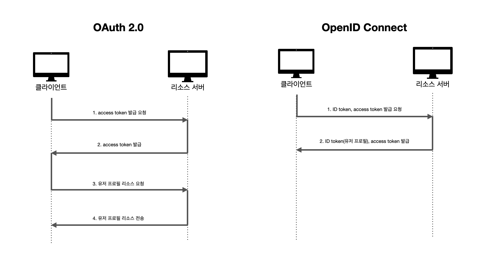
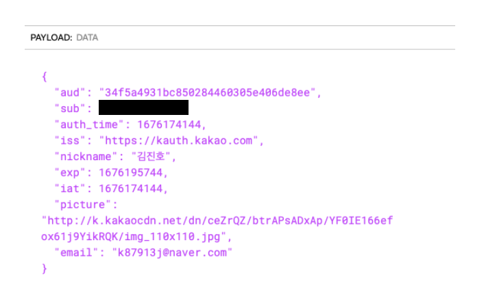

# TIL - 2025.03.14 (목요일)

## 📝 오늘 배운 것

### 소셜로그인
> 소셜 로그인은 사용자가 새로운 계정을 생성하지 않고 기존 소셜 미디어 계정을 통해 웹사이트나 앱에 로그인할 수 있게 해주는 인증방식이다.

#### 소셜로그인 작동 과정
1. 사용자가 웹사이트나 앱에서 "Google로 로그인" 또는 "Facebook으로 로그인"과 같은 소셜 로그인 옵션을 선택한다.
2. 사용자는 해당 소셜 플랫폼의 로그인 페이지로 리디렉션한다.
3. 소셜 플랫폼에서 사용자 인증을 진행하고, 사용자는 앱이 요청하는 권한(이름, 이메일 등)에 동의한다.
4. 소셜 플랫폼이 사용자의 신원을 확인하고 앱으로 다시 리디렉션한다
5. 앱은 소셜 플랫폼으로부터 받은 정보를 사용하여 사용자를 인증하고 로그인 처리를 완료.

#### 기술적 기반
- OAuth 2.0: 소셜 네트워크 데이터에 대한 안전한 접근 권한을 부여하는 인가(authorization) 프로토콜이다.
- OpenID Connect: OAuth 2.0위에 구축된 인증(authentication)프로토콜로, 제3자 로그인을 지원한다.

#### 구현 시 주의 사항
1. 보안 관련 고려사상
- OAuth 흐름의 보안 구현을 확실히 해야 한다.
- 사용자 데이터 접근에 대한 명확한 권한 요청과 관리가 필요하다.
- 소셜 계정과 기존 계정 간의 연결 시 보안 검증 절차를 구현해야 한다.

2. 사용자 경험 최적화
- 인기 있는 소셜 네트워크를 선택하여 제공해야 한다.
- 적절한 버튼 형식과 위치를 선정해야 한다.
- 사용자가 이전에 어떤 소셜 계정으로 로그인 했는지 알려주는 기능이 유용하다.

3. 데이터 관리
- 중복 계정 방지 로직을 구현해야 한다.
- 이메일 주소를 기본 식별자로 사용하는 것이 일반적이다.
- 소셜 계정 연결/해제 기능을 제공해야 한다.

### OAuth 2.0과 OpenID Connect의 차이점

#### 기본 목적의 차이
OAuth 2.0:
- 주로 권한 부여(Authorization)를 위한 프로토콜이다.
- 사용자 데이터에 대한 접근 권한을 제어하고 위힘하는 데 중점을 둔다.
- 리소스 접근을 위한 엑세스 토큰을 제공한다.
- 사용자 인증 자체를 다루지 않는다.

OpenID Connect:
- 인증(Authentication)를 위한 프로토콜이다.
- OAuth 2.0 위에 구축된 ID 레이어로 작동한다.
- 사용자가 누구인지 확인하는 데 중점을 둔다.
- 단일 로그인(SSO) 기능을 제공한다.

#### 토큰 유형의 차이
OAuth 2.0:
- 엑세스 토큰과 리프레시 토큰만 제공한다.
- 엑세스 토큰과 리소스 접근 권한을 나타낸다.

OpenID Connect:
- ID 토큰, 엑세스 토큰, 리프레시 토큰을 제공한다.
- ID 토큰은 JWT 형식으로 사용자 신원 정보를 포함한다.

 (출처 : https://velog.io/@wlsh44/OpenID-Connect%EC%99%80-OAuth2.0) 

#### ID Token
- `aud`: Client ID
- `sub`: 리소스 서버 내의 유저 식별자
- `iss`: 토큰 발급자(IDP, ID Provider)
- `iat`,`exp`: 토큰 발급 및 만료 시간

(ID Token 예시 출처 : https://velog.io/@wlsh44/OpenID-Connect%EC%99%80-OAuth2.0) 

ID token에서 중요한 점은 토큰에 잠을 scope의 범위가 profile, email, address, phone 으로 정해져 있으며 ([scope 공식 문서](https://openid.net/specs/openid-connect-core-1_0.html#ScopeClaims)) 그리고 payload에 담는 Claims의 이름도 표준화되었다([표준 Claims 공식 문서](https://openid.net/specs/openid-connect-core-1_0.html#StandardClaims)) 때문에 OIDC를 사용하는 여러 서비스들의 규격을 하나로 통일 할 수 있다는 장점이 있다.

OAuth는 인증에 성공한 유저에게 리소스에 대한 접근 권한인 access token만을 제공한다. 물론 토큰의 만료시간, scope, refresh token등의 정보도 포함되어 있지만 여기에 있는 어떤 필드에도 유저에 대한 정보는 존재하지 않고 유저의 정보를 얻기 위해 access token을 이용해 다시 유저의 정보를 요청해야 한다. 반면 ID Token에는 유저의 프로필, 이메일 등 민감하지 않은 정보들이 포함될 수 있고 이 때문에 소셜 프로필을 기반으로 회원 정보를 요청하는 수를 줄일 수 있다.

#### Oauth를 인증 목적으로 사용했을 시의 결함
1. 클라이언트가 access token의 실제 대상(audience)이 아니기 때문에 위에서 발생한 문제처럼 클라이언트가 유저의 어떠한 정보도 알지 못한다.
2. 리소스 서버와 유저간의 연결이 없기 때문에 리소스 서버 입장에서는 실제로 토큰이 인증을 한 유저와 함꼐 있는지를 알 수 없다.
3. access token을 얻기 위해서는 인증이 필요하기 때문에 인증의 근거로 생각할 수 있지만, 2와 같은 이유로 인증의 근거로 사용하기 어렵다. 또한 access token은 항상 인증을 해야만 얻을 수 있는게 아니라 refresh token 등을 통해서도 얻을 수 있다는 문제점이 있다.
4. OAuth는 audience를 제한하는 기능이 없기 때문에 단순 로그인의 용도라면 어떤 클라이언트에서 발급받은 access token을 다른 클라이언트에서도 사용할 수 있게 된다. 다른 클라이언트는 해당 토큰이 본인이 발급 받은 토큰인지, 외부에서 발급된 토큰인지 파악할 수 없기 때문이다.

이 외의여러 문제점은 OAuth 공식 홈페이지에 있다.([oauth.net](https://oauth.net/articles/authentication/#:~:text=Common%20pitfalls%20for%20authentication%20using%20OAuth))

#### 사용 사례
OAuth 2.0:
- 한 앱이 사용자 인증 없이 다른 앱의 데이터에 접근해야 할 때 사용
- 예: 타사 앱이 Facebook 데이터에 접근하도록 허용
OpenID Connect:
- 사용자 인증이 필요한 경우에 사용
- 예: Google 계정을 사용하여 애플리케이션에 로그인

## 💡 문제 해결

> 소셜로그인을 구현하기 위해 알아야 하는 OAuth 와 OpenID Connect에 대한 것을 알아보고 그 차이를 이해해 보았다.

## 🔍 더 알아볼 것

- [ ] 소셜로그인의 실무 적용을 위해 알아야 할 세부 사항

## 🧐 느낀 점

소셜로그인은 어렵다. 적용은 빠르게 가능했지만 실제 검증 과정과 이 후 서비스에서 적용해야 하는 것들을 잘 챙겨야 할 것 같다.

## 📚 참고 자료

- [OpenID Connect와 OAuth2.0](https://velog.io/@wlsh44/OpenID-Connect%EC%99%80-OAuth2.0)