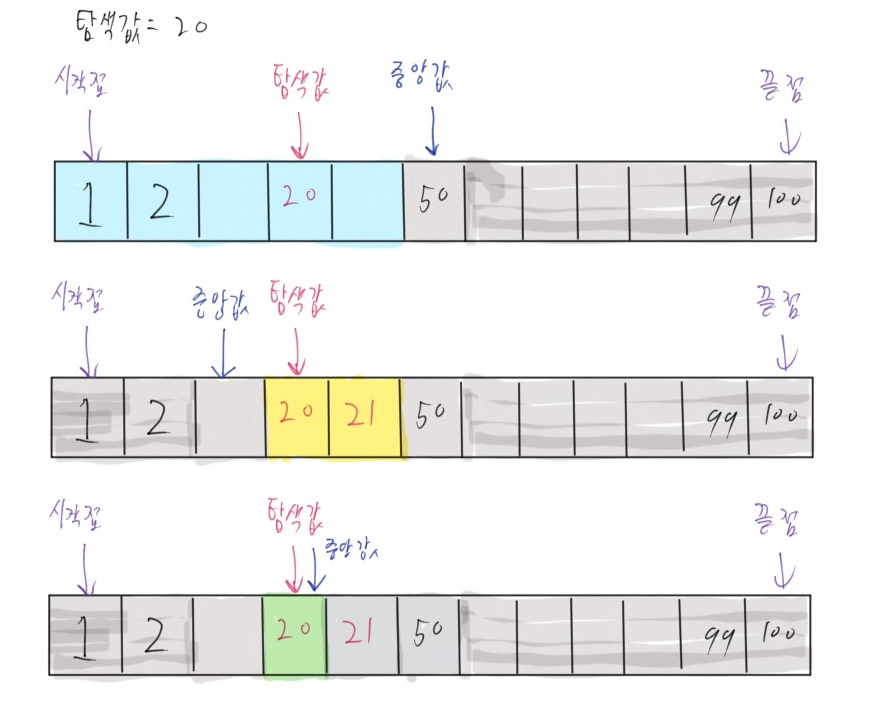
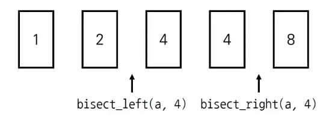
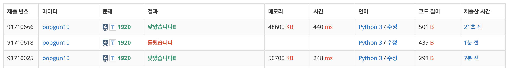

# TIL - 2025.03.20 (목요일)

## 📝 오늘 배운 것 (이분 탐색/이진 탐색)

### 이진 탐색(이분 탐색)

`이진 탐색(이분 탐색)` 은 리스트가 정렬되어 있는 상태일 때(필수 !!) 탐색 범위를 절반씩 좁혀가며 데이터를 탐색하는 방법이다.

- 정말 필수 적으로 정렬이 되어 있는 상태의 데이터 셋에서 탐색을 진행해야 한다.
- 시작, 종료, 중간을 나타내는 변수 값을 이용해 데이터를 찾는다.



쉽게 이해를 위해 1 부터 100까지 데이터가 들어있는 리스트가 있다고 하자. 이 리스트는 정렬되어 있다. 즉 1부터 100까지 순차적으로 데이터가 들어있다고 하자

이제 우리는 이 리스트에서 25라는 데이터를 찾아보겠다.

```python
num_list = [i for i in range(1, 101)]

def binary_search(start, end, target):
    while start <= end:
        mid = (start + end) // 2
        
        if num_list[mid] == target:
            return mid
        elif num_list[mid] > target:
            end = mid - 1
        else:
            start = mid + 1
    return None
```

위 코드는 이진 탐색의 간단한 예시이다. 시작점과 끝점을 더한 값을 2로 나눈 값을 중간점으로 두고 선택한 중간 값이 목푯값과 같은지 확인을 한다.

이 때 중간 값을 이용해 확인하는 이유는 이미 데이터 들이 순차적으로 정렬이 되어 있는 상황이니 중간 값을 확인했을 때 찾으려는 데이터가 없으면 오른 쪽 값을 더이상 볼 필요가 없는 것이다.

이 후 계속 반복을 하면서 중간 값을 확인하고 우리가 찾으려는 목푯값이 중간 값보다 큰 곳에 위치한다면 왼쪽값을 더이상 확인하지 않겠다는 것이 가장 주요하다.

더 쉽게 생각하면 미디어 매체에서 자주 접함 업다운 게임이다.

- 이분 탐색의 시간 복잡도는 `O(logN)`이다.

## Python 이진 탐색 라이브러리에

python에서는 `bisect`이라는 이진 탐색 라이브러리를 지원한다.

- `bisect_left(a, x)` -> 정렬된 순서를 유지하면서 리스트 a에 데이터 x를 삽입할 가장 안쪽 인덱스를 찾는 메소드
- `bisect_right(a, x)` -> 정렬된 순서를 유지하면서 리스트 a에 데이터 x를 삽입할 가장 오른쪽 인덱스를 찾는 메소드

```python
from bisect import bisect_left, bisect_right
a = [1, 2, 4, 4, 8]
x = 4

print(bisect_left(a, x))
>>> 2
# 리스트 a에 4를 삽입할 가장 왼쪽 인덱스는 2이다.

print(bisect_right(a, x))
>>> 4
# 리스트 a에 4를 삽입할 가장 오른쪽 인덱스는 4이다.
```

<center>그림 출처 : https://freedeveloper.tistory.com/275그림 출처 : https://freedeveloper.tistory.com/275</center>


## 💡 문제 해결

> https://www.acmicpc.net/problem/1920

실제 문제를 풀어 보면 이해를 하기 쉬울 것 같다.위 문제는 백준 1920 수 찾기 문제이다.

### 문제

N개의 정수 A[1], A[2], …, A[N]이 주어져 있을 때, 이 안에 X라는 정수가 존재하는지 알아내는 프로그램을 작성하시오.

### 입력

첫째 줄에 자연수 N(1 ≤ N ≤ 100,000)이 주어진다. 다음 줄에는 N개의 정수 A[1], A[2], …, A[N]이 주어진다. 다음 줄에는 M(1 ≤ M ≤ 100,000)이 주어진다. 다음 줄에는 M개의 수들이 주어지는데, 이 수들이 A안에 존재하는지 알아내면 된다. 모든 정수의 범위는 -231 보다 크거나 같고 231보다 작다.

### 출력

M개의 줄에 답을 출력한다. 존재하면 1을, 존재하지 않으면 0을 출력한다.

이 문제를 이진 탐색을 배우지 않고 봤다면 당연히 반복문으로 풀어야 겠다는 생각을 할 수 있을 것 같다. 하지만 이 문제에는 입력 값을 잘 봐야 한다. 입력 값에 M 이 1부터 100,000 개 까지 주어진다는 것이다.

알고리즘을 배우다 보면 많이 듣는 것 중에 하나가 일반적으로 컴퓨터가 1억번 계산을 하면 1초가 걸린다는 것이다. 물론 이 것은 컴퓨터 사양이 다 다르기 때문에 정확한 값은 아니지만 대략적으로 1억번을 넘어가면 1초가 넘는다고 생각하면 좋을 것이다. 그렇다면 10만번의 입력이 들어온다고 하면 이를 이중 for문을 사용하기만해도 1억은 우습고 100억에 육박하는 계산이 들어갈 것이다. 이는 무조건 시간초과가 난다는 것이다. 그렇다면 방법은 우리가 배운 이진 탐색을 사용해 문제를 해결해야 한다.

```python
n = int(input())
n_list = list(map(int, input().split()))
m = int(input())
m_list = list(map(int, input().split()))
n_list.sort()

#1. 이진탐색 구현

def binary_search(start, end, target, data_list):
    while start <= end:
        mid = (start + end) // 2
        if target == data_list[mid]:
            return 1
        elif target < data_list[mid]:
            end = mid - 1
        else:
            start = mid + 1
    return 0

for i in m_list:
    print(binary_search(0, n-1, i, n_list))


#2. python bisect 사용

from bisect import bisect_left, bisect_right
for i in m_list:
    if bisect_left(n_list, i) != (bisect_right(n_list, i)):
        print(1)
    else:
        print(0)
```

2가지 방법에 대해 문제 풀이를 진행했다.

1. 이진 탐색을 직접 구현하여 풀이
2. python bisect를 사용해 문제 풀이

python의 bisect를 사용한 값이 둘이 같지 않을 때 찾으려고 하는 값이 있다고 작성했다. 이는 bisect_left 가 우리가 찾고 싶은 값이 삽입 가능한 왼쪽 인덱스 번호를 반환하고 bisect_right는 반대로 삽입 가능한 오른쪽 인덱스를 반환한다는 위에 삽입했던 예시 이미지를 확인하면 이해가 쉬울 것이다. 즉 우리가 찾고 싶은 값이 없는 경우 bisect는 왼쪽 오른쪽 값을 탐색하는 리스트의 이쯤 있을 것 같다는 답을 주게 되는데 그 값이 같은 값이 반환되고 이 두값이 가다는 것은 우리가 찾고 싶은 데이터가 들어있지 않다는 것을 의미한다.



제일 아래 결과가 파이썬 bisect 라이브러리 사용 결과 제일 위 결과가 이진탐색을 구현해서 사용한 결과이다. 중간에 틀린 값은 오타로 틀린 것이니 못 본척 해주시길...

시간 차이가 2배 가까이 나는데 역시 사용가능하다면 파이썬 라이브러리를 이용해서 구현하는 것이 문제 푸는 것에는 좋지만 현재는 알아가는 시간이라 직접 구현하는 것에 의의를 둘 것이다.

## 🔍 더 알아볼 것

- [ ] 이진 탐색을 사용하는 문제 추가 풀이

## 🧐 느낀 점

이진 탐색을 이미 알고 있었지만 직접 구현해 풀어보고 라이브러리를 적용하며 좀 더 이해하는 시간을 가질 수 있었다.

## 📚 참고 자료

- [이분탐색(Binary Search),upper_bound,lower_bound (C++)](https://charles098.tistory.com/133)