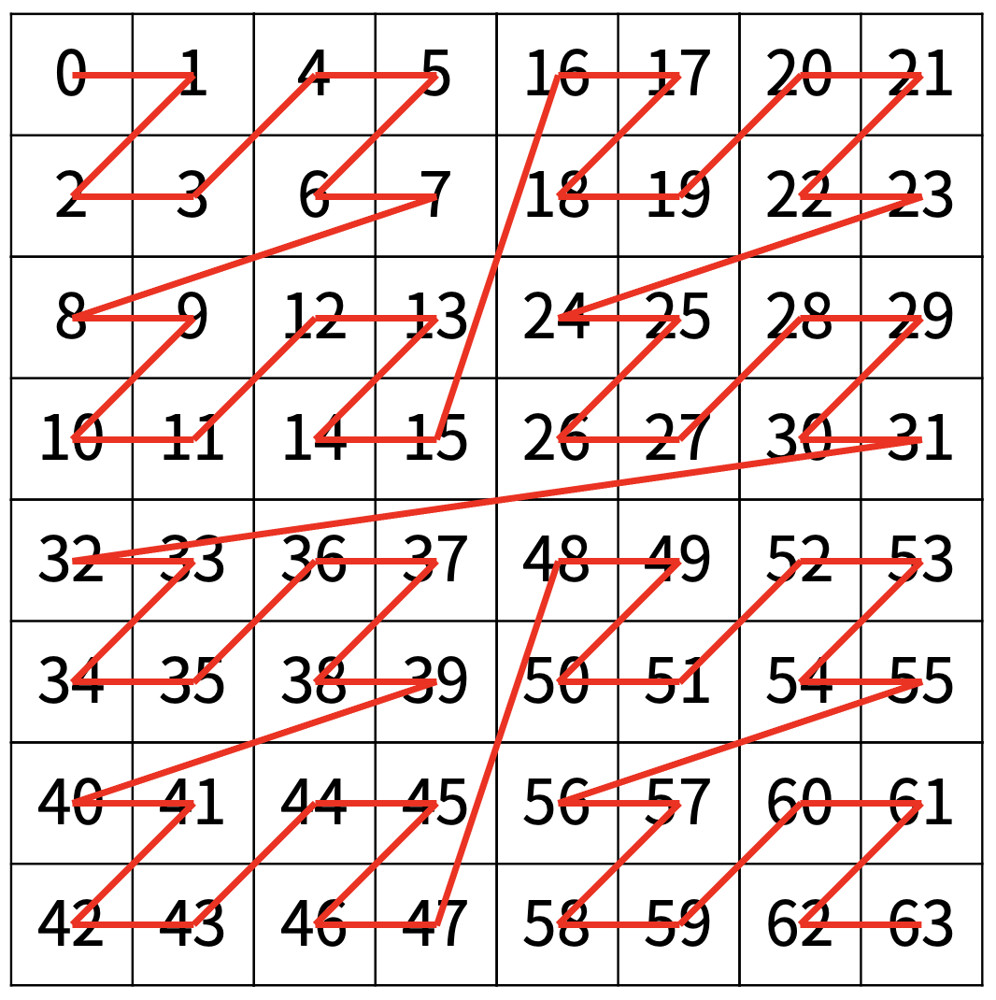
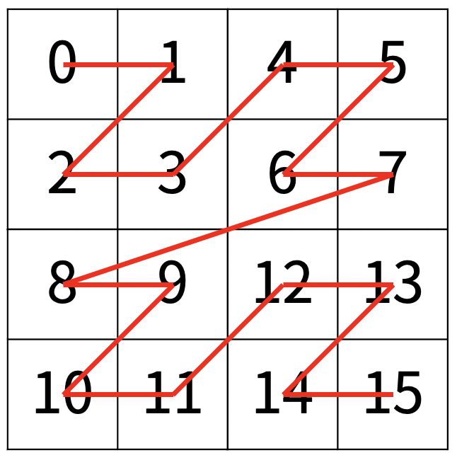
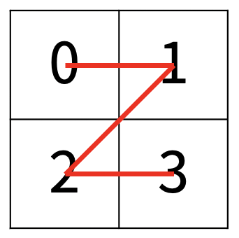

# TIL - 2025.03.21 (금요일)

## 📝 오늘 배운 것 (분할 정복 알고리즘 (Divide and Conquer))

### 분할 정복 알고리즘이란

분할 정복 알고리즘(Divide and Conquer Algorithm)은 그대로 해결할 수 없는 문제를 작은 문제로 분할하여 해결하는 방법이나 알고리즘이다.

분할 정복 알고리즘은 재귀적인 방법을 통해 문제를 해결하며, 대표적인 예시로 이진탐색(Binary Search), 병합 정렬(Merge Sort), 퀵정렬(Quick Sort)가 예로 들 수 있다.

### 동적계획법(Dinamic Programming)과 다른 점

다이나믹 프로그램 역시 한 문제를 작게 나눈 다는 점에서 유사한 접근 방식을 가지고 있지만 차이가 있다.

- 분할 정복 - 문제를 작게 나누어 해결하고, 이 해결을 결합하여 원래의 문제를 해결한다. 재귀를 이용해 구현하는 것이 일반적이며 부분 문제들이 서로 독립적일 때 사용하기 좋다. 그 예가 합병정렬이다.
- 동적 계획법 - 하위 문제들을 한 번씩만 계산하고 이를 이용해여 상위 문제를 효율적으로 계산하는 것이 목적 반복을 이용해 구현하는 것이 일반적이며 부분 문제들이 서로 종속적일 때 사용하기 좋다. 예로는 최단 경로 문제가 있다.

### 분할 정복 알고리즌 탐색 과정

1. **분할** : 문제를 작은 하위 문제로 분할
2. **정복** : 각 하위 문제를 재귀적으로 해결
3. **결합** : 하위 문제의 해결책을 결합하여 원래 문제를 해결

#### 백준 1074 Z

크래프톤 정글 8기 1주차 학습 문제로 나왔던 것이 Z 이다. 1주차에서는 재귀를 학습하기 위한 문제로 선택되었지만 더 세부적으로 이 문제는 분할 정복에 포함된다는 것이다.

[백준 1074 Z](https://www.acmicpc.net/problem/1074)



16*16 사이즈의 배열에서 원하는 값을 얻기위해 문제 설명에도 있듯 작은 문제로 나누어 설명하고 있다.





이 문제는 배열의 중앙 값을 기준으로 4개의 구간으로 나누고 이구간을 다시 4개의 구간으로 나누어 2*2 사이즈의 배열에서 원하는 값을 계산하는 것이다.

### 분할정복 장단점

#### 장점:

1. 빠른 속도: 큰 문제를 작은 하위 문제로 분할하고 해결하여 전체 문제를 해결하는 데 걸리는 시간을 줄일 수 있다.
2. 쉬운 병렬화: 분할정복 알고리즘은 하위 문제를 병렬로 처리하며 이는 멀티코어 시스템에서 성능을 향상할 수 있다.
3. 유연성: 여러 응용 분야에서 사용할 수 있으며, 문제의 복잡도와 데이터 크기에 상관없이 작용 할 수 있다.

#### 단점:

1. 추가적인 메모리 요구: 재귀적인 호출로 많은 추가 메모리가 필요할 수 있다.
2. 최악 시간 복잡도: 분할 정복 알고리즘이 항상 최악의 경우에도 빠른 해결책을 제공하는 것은 아니다.
3. 구현의 복잡성: 구현이 복잡하다.

### 시간 복잡도

분할 정복의 시간 복잡도는 분할, 결합, 정복 세 단계에서 각각의 연산량에 따라 결정된다. 

#### 시간복잡도 : **O(NlogN)**

일반 적인 시간복잡도로 문제의 특성에 따라 달라질 수 있다.

## 📖 예시 문제

[백준 2630 색종이 만들기](https://www.acmicpc.net/problem/2630)

[백준 1992 쿼드 트리](https://www.acmicpc.net/problem/1992)

[백준 16505 별](https://www.acmicpc.net/problem/16505)

[백준 17829 222풀링](https://www.acmicpc.net/problem/17829)

## 💡 문제 해결

백준 1629 곱셈

```python
a, b, c = map(int, input().split())

def dac(a, b, c):
    if b == 1:
        return a % c
    elif b % 2 == 0:
        return (dac(a,b//2,c)**2)%c
    else:
        return ((dac(a,b//2,c)**2)*a)%c

print(dac(a,b,c))
```
크래프톤 정글 알고리즘 2주차에 분할정복 키워드로 포함된 문제인데 분할 정복을 이용해 거듭 재곱을 계산 할 수 있다.

## 🔍 더 알아볼 것

- [ ] 분할 정복 문제 더 풀기

## 🧐 느낀 점

분할 정복 정말 어렵다... 재귀가 아직 어려워서 더 그렇게 느껴지는 것인지 분할에 대한 아이디어가 잘 떠올려지지 않아 서 그런 것 같다.

## 📚 참고 자료

- [[알고리즘] Divide and Conquer Algorithm : 분할정복 알고리즘을 알아보자](https://olrlobt.tistory.com/45)