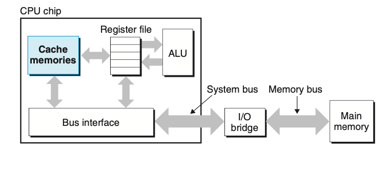
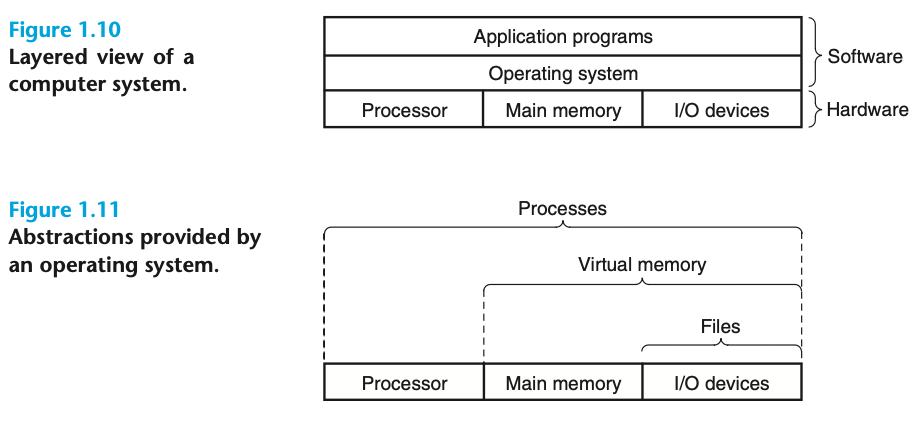

# TIL - 2025.03.22 (토요일)

## 📝 오늘 배운 것 (CSAPP 1-5 ~ 1.7)

### 1.5 캐시가 중요하다.

앞선 예제로부터 얻을 수 있는 중요한 교훈은 시스템이 정보를 한 곳에서 다른 곳을 ㅗ이동시키는 일에 많은 기산을 보낸다는 것이다.

hello 프로그램의 기계어 인스트럭션들은 본래 하드디스크에 저장되어 있다가 프로그램이 로딩될 때 메인메모리로 복사된다. 프로세서가 프로그램을 실행할 때 인스트럭션들은 메인 메모리에서 프로세서로 복사된다.

"hello, world\n" 데이터 스트링도 본래는 디스크에 저장되어 있었다가 메인 메모리로 복사되었다가 디스플레이 장치로 복사된다. 프로그래머의 관점에서 이러한 여러 복사과정들이 프로그램의 **실제 작업**을 느리게 하는 오버헤드이다.

그래서 시스템 설계자들의 주요 목적은 이러한 복사과정들을 가능한 한 빠르게 동작하도록 하는 것이다.

물리학의 법칙 때문에 더 큰 저장장치들은 보다 작은 저장장치들 보다 느린 속도를 갖는다. 일반적인 시스템의 디스크 드라이브는 메인 메모리보다 1000배 크기가 더 크집만 프로세서가 디스크에서 1워드의 데이터를 읽어들이는 데 걸리는 시간은 메모리에서보다 천만배 더 오래 걸릴 수 있다.

마찬가지로 일반적인 레지스터 파일은 수백 바이트의 정보를 저장하는 반면, 메인 메모리의 경우는 십억 개의 바이트를 저장한다. 메인 메모리를 더 빠르게 동작하도록 만드는 것보다 프로세서를 더 빨리 동작하도록 만드는 것이 더 쉽고 비용이 적게 든다.

프로세서-메모리 간 격차에 대응하기 위해 시스템 설계자는 보다 작고 빠른 **캐시 메모리** 라고 부르는 저장장치를 고안하여 프로세서가 단기간에 필요로 할 가능성이 높은 정보를 임시로 저장할 목적으로 사용한다.

프로세서 칩 내에 들어 있는 L1 캐시는 대략 수천 바이트의 데이터를 저장할 수 있으며, 거의 레지스터 파일만큼 빠른 속도로 액세스 할 수 있다. 이보다 좀 더 큰 L2 캐시는 수백 킬로바이트에서 수 메가 바이트의 용량을 가지며 프로세서와 전용 버스를 통해 연결된다.

> L1, L2 캐시는 *SRAM(Static Random Access Memory)*라는 하드웨어 기술을 이용해 구현한다.

캐시 시스템의 이면에 깔려 있는 아이디어는 프로그램이 지엽적인 영역의 코드와 데이터를 액세스하는 경향인 *지역성 locality*을 활용하여 시스템이 매우 크고 빠른 메모리 효과를 얻을 수 있다는 것이다. 자주 액세스 할 가능성이 높은 데이터를 캐시가 보관하도록 설정하면 빠른 캐시를 이용해서 대부분의 메모리 작업을 수행할 수 있게 된다.

캐시 메모리를 이애하는 응용 프로그래머는 캐시를 활용하여 자신의 프로그램 성능을 10배 이상 개선할 수 있다는 것이다.

### 1.6 저장장치들은 계층구조를 이룬다

작고 빠른 저장장치를 프로세서와 좀 더 크고 느린 장치 사이에 끼워 넣는 개념은 일반적인 아이디어로 판명되었다. 모든 컴퓨터 시스템의 저장장치들은 메모리 계층구조로 구성되어 있다. 계층의 꼭대기에서 부터 맨 밑바닥까지 이동할수록 저장장치들은 더 느리고, 더 크고, 바이트당 가격이 싸진다.

- 레지스터 파일은 레벨 0, 즉 L0이다.
- 레벨 1에서 3 까지 캐시를 사용한다.
- 레벨 4에 메인 메모리가 위치한다.
- 레벨 5에 디스크가 있다.

메모리 계층 구조의 주요 아이디어는 한 레벨의 저장장치가 다음 하위레벨 저장장치의 캐시 역할을 한다는 것이다. L1, L2의 캐시는 각각 L2, L3의 캐시이다. L3 캐시는 메인 메모리의 캐시이고 이 캐시는 디스크의 캐시 역할을 한다. 일부 분산 파일 시스템을 가지는 네트워크 시스템에서 로컬 디스크는 다른 시스템의 디스크에 저장된 데이터의 캐시 역할을 수행한다.

로컬디스크들은 원격 네트워크 서버에서 파일들을 가져와 보관한다. 프로그래머들이 성능을 개선한기 위해서 다른 종류의 캐시들을 활용할 수 있듯이 프로그래머는 전체 메모리 계층구조에 대한 지식을 활용할 수 있다.

### 1.7 운영체제는 하드웨어를 관리한다.

hello 프로그램을 로드하고 실행했을 때와 hello 프로그램이 메시지를 출력할 때, 프로그램이 키보드나 디스플레이, 디스크나 메인 메모리를 직접 액세스 하지 않았다. 오히려 *운영체제 Operation System*가 제공하는 서비스를 활용한다. 운영체제는 하드웨어와 소프트웨어 사이에 위치한 소프트웨어 계층으로 생각할 수 있다.

응용프로그램이 하드웨어를 제어하려면 언제나 운영체제를 통해서 해야 한다.

운영체제는 두 가지 주요 목적을 가지고 있다.

1. 제멋대로 동작하는 응용프로그램들이 하드웨어를 잘못 사용하는 것을 막는다.
2. 응용프로그램들이 단순하고 균일한 메커니즘을 사용하여 복잡하고 매우 다른 저 수준 하드웨어 장치들을 조작할 수 있다.

운영체제는 이 두가지 목표를 근본적인 추상화를 통해 달성하고 있다.

> 프로세스, 가상메모리, 파일

파일은 입출력장치의 추상화이고, 가상 메모리는 메인 메모리와 디스크 입출력 장치의 추상화, 그리고 프로세스는 프로세스, 메인 메모리, 입출력장치 모두의 추상화 결과이다.

#### 1.7.1 프로세스 (Proccess)

hello 같은 프로그램이 최신 시스템에서 실행될 때 운영체제는 시스템에서 이 한개의 프로그램만 실행되는 것 같은 착각에 빠지도록 한다. 프로세서는 프로그램 내의 인스트럭션들을 다른 방해 없이 순차적으로 실행하는 것 처럼 보인다. 이러한 환상은 전산학에서 가장 중요한 프로세스라고 하는 개념에 의해서 만들어진다.

- 프로세스는 실행 중인 프로그램에 대한 추상화다.

닥수의 프로세스들은 동일한 시스템에서 동시에 실행될 수 있으며, 각 프로세스는 하드웨어를 배타적으로 사용하는 것처럼 느낀다. 동시에 concurrently 라는 말은 한 프로세스의 인스트럭션들이 다른 프로세스의 인스트럭션들과 섞인다는 것을 의미한다.

프로세서가 프로세스들을 바꿔주는 방식으로 한개의 CPU가 다수의 프로세스를 동시에 실행하는 것처럼 보이게 해준다.

운영체제는 **문맥 전환 context switching** 이라는 방법을 사용해서 이러한 교차실행을 수행한다. 운영체제는 프로세스가 실행하는 데 필요한 모든 상태정보의 변화를 추적한다. 이 **컨택스트**라고 부르는 상태정보는 PC,레지스터 파일, 메인 메모리의 현재 값을 포함하고 있다. 어느 한 순간에 단일 프로세서에서 다른 새로운 프로세스로 제어를 옮기려고 할 때 현재 프로세스의 컨택스트를 저장하고 새 프로세스의 컨택스트를 복원시키는 문맥전환을 실행하여 제어뤈을 새 프로세스로 넘겨준다. 새 프로세스는 이전에 중단했던 바로 그위치부터 다시 실행된다.

예제에는 두 개의 동시성 concurrent 프로세스가 존재한다. 쉘 프로세스와 hello 프로세스, 청음에는 쉘 프로세스가 혼자서 동작하고 있다가 명령줄에서 입력을 기다린다. hello 프로그램을 실행하라는 명령을 받으면 쉘은 **시스템 콜** 이라는 특수 함수를 호출하여 운영체제로 제어권을 넘겨준다. 운영체제는 쉘을 컨텍스트를 저장하고 새로운 helo 프로세스와 컨택스트를 생성한 뒤 제어권을 새 hello 프로세스로 넘겨준다. hello가 종료되면 운영테제는 쉘 프로세스의 컨텍스트를 복구시키고 제어권을 넘겨주면서 다음 명령 줄 입력을 기다린다.

##### **커널**

하나의 프로세스에서 다른 프로세스로의 전환은 운영체제 **커널**에 의해 관리된다. 커널은 운영체제 코드의 일부분으로 메모리에 상주한다. 응용프로그램이 운영체제에 의한 어떤 작업을 요청하면, 컴퓨터는 파일 읽기나 쓰기와 같은 특정 **시스템 콜**을 실행해서 커널에 제어를 넘겨준다. 그러면 커널은 요청된 작업을 수행하고 응용프로그램으로 리턴ㄴ한다. 커널은 별도의 프로세스가 아니라는 점에 유의 해야 한다. 대신 , 커널은 모든 프로세스를 관리하기 위해 시스템이 이용하는 코드와 자료 구조의 집합이다.

프로세스 추상화를 구현하기 위해서는 저수준의 하드웨어와 운영체제 소프트웨어가 함꼐 긴밀하게 협력해야 한다.

#### 1.7.2 쓰레드(Thread)

프로세스가 마치 한 개의 제어흐름을 갖는 것으로 생각할 수 있지만, 최근의 시스템에서는 프로세스가 실제로 쓰레드(thread)라고 하는 다수의 실행 유닛으로 구성되어 있다. 각각의 쓰레드는 해당 프로세스의 컨텍스트에서 실행되며 동일한 코드와 전역 데이터를 공유한다. 쓰레드는 프로그래밍 모델로서의 중요성이 더욱 커지고 있는데, 그 이유는 다수의 프로세스들에서보다 데이터 공유가 더 쉽다는 점과 쓰레드가 프로세스보다 더 효율적이라는 점 때문이다. 다중 쓰레딩도 다중 프로세서를 활용할 수 있다면 프로그램의 실행 속도를 빠르게 하는 한 가지 방법이다.

#### 1.7.3 가상메모리

가상 메모리는 각 프로세스들이 메인 메모리들이 메인 메모리 전체를 독점적으로 사용하고 있는 것 같은 환상을 제공하는 추상화이다. 각 프로세스는 가상주소 공간이라고 하는 균일한 메모리의 모습을 갖게 된다. 리눅스에서, 주소공간의 최상위 영역은 모든 프로세스들이 공통으로 사용하는 운영체제의 코드와 데이터를위한 공간이다. 주소공간의 하위 영역은 사용자 프로세스의 코드와 데이터를 저장한다. 그림에서 위로 갈수록 주소가 증가하는 점에 주의하라

- 프로그램 코드와 데이터, 코드는 모든 프로세스들이 같은 고정 주소에서 시작하며, 다음에 C 전역변수에 대응되는 데이터 위치들이 따라온다. 코드와 데이터 영역은 실행가능 묙적파일인 hello로 부터 직접 초기화 된다.
- 힙 heap 코드와 데이터 영역 다음으로 런타임 힙이 따라온다. 크기가 고정되어 있는 코드, 데이터 영역과 갈리, 힙은 프로세스가 실행되면서 C 표준함수인 malloc이나 free를 호출하면서 런타임에 동적으로 그 크기가 늘었다 줄었다 한다.
- 공유 라이브러리 주소 공간의 중간 부근에 C표준 라이브러리나 수학 라이브러리와 같은 공유 라이브러리의 코드와 데이터를 저장하는 영역이 있다.
- 스택 stack 사용자 가상메모리 공간의 맨 위에 컴파일러가 함수 호출을 구현하기 위해 사용하는 사용자 스택이 위치한다. 힙과 마찬가지로 사용자 스택은 프로그램이 실행되는 동안에 동적으로 늘어났다 줄어들었다 한다. 특히, 함수 호출할 때마다 스택이 커지며, 함수에서 리턴될 때는 줄어든다.
- 커널 가상메모리 주소공간의 맨 윗부분은 커널을 위해 예약되어 있다. 응용프로그램들은 이 영역의 내용을 읽거나 쓰는 것이 금지되어 있으며, 마찬가지로 커널 코드 내에 정의된 함수를 직접 호출하는 것도 금지되어 있다. 대신 이런 작업을 수행하기위해 커널을 호출해야 한다.

가상메모리가 작동하기 위해서는 프로세서가 만들어내는 모든 주소를 하드웨어로 번역하는 등의 하드웨어와 운영체제 소프트웨어 간의 복잡한 상호작용이 필요하다. 기본적인 아이디어는 프로세스의 가상메모리의 내용을 디스크에 저장하고 메인 메모리를 디스크의 캐시로 사용하는 것이다.

#### 1.7.4 파일

파일은 연속된 바이트들이다. 디스크, 키보드, 디스플레이, 네트워크까지 포함하는 모든 입출력장치는 파일로 모델링한다. 시스템의 모든 입출력은 유닉스 I/O라는 시스템 콜들을 이용하여 파일을 읽고 쓰는 형태로 이루어진다.
