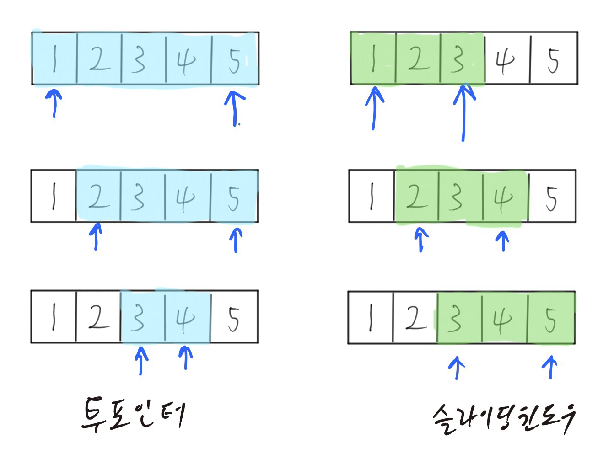

# TIL - 2025.03.23 (일요일)

## 📝 오늘 배운 것 (슬라이딩 윈도우 알고리즘)

### 슬라이딩 윈도우 알고리즘 (Sliding Window)

- 슬라이딩 윈도우는 고정 사이즈의 윈도우가 이동하면서 윈도우 내에 있는 데이터를 이용해 문제를 풀이하는 알고리즘이다.
- 교집합의 정보를 공유하고, 차이가 나는 양쪽 끝 원소만 갱신하는 방법이다.
- 배열이나 리스트의 요소의 일정 범위 값을 비교할 때 사용하면 좋다.
- 투 포인터 알고리즘과 연동하여 많이 사용된다.
주로 정렬된 배열을 대상으로 하는 투 포인터와 달리 슬라이딩 윈도우는 정렬 여부에 관계없이 활용된다.



죄측의 투 포인터는 주로 정렬된 배열을 대상으로 한다. [1,2,3,4,5]가 모두 순서대로 정렬되어 있으며, 처음에는 2개의 포인터가 1과 5를 가리키고 있으나 그다음에는 왼쪽 포인터만 2를 가리키도록 이동했고, 또 그다음에는 2개의 포인터가 모두 움직여 3,4를 가리킨다.

이처럼 윈도우의 사이즈가 가변적이며 좌우 포인터가 자유롭게 이동할 수 있는 방식이 투 포인터인 반면 슬라이딩 윈도우는 [1,3,4,2,5]와 같이 정렬되어 있지 않은 배열에도 적용할 수 있다. 윈도우 사이즈는 고정이며, 좌 또는 우 한쪽 방향으로만 이동한다.

슬라이딩 윈도우는 특정 구역의 합계나 평균을 구하는데 유용하다. 1년의 기온을 확인하는데 3일간의 평균 기온이 가장 높은 구간은 어딩니지 확인할 때, 주식에서 5일간의 평균 거래량을 확인할 때, 회사에서 물건의 판매량이 가장 높은 월이 언제인지 확인할 때 등 구간을 정해두고 그 구간들 중 최대값을 구할 때 사용한다.

- 선형 공간(1차원 배열을)2회 이상 반복적으로 탐색햐야 할 경우 O(N^2) 이상 걸릴 시간 복잡도를 부분 배열을 활용하여 O(N)으로 줄일 수 있다는 점이 투 포인터와 같다.

## 💡 문제 해결 (백준 21921 블로그)

[백준 21921 블로그](https://www.acmicpc.net/problem/21921)

```python
import sys
input = sys.stdin.readline

n, x = map(int, input().split())
visits = list(map(int, input().split()))

if max(visits) == 0:
    print("SAD")
    exit(0)

value = sum(visits[:x])
max_value = value
cnt = 1
for i in range(x, n):
    value += visits[i]
    value -= visits[i-x]
    if value > max_value:
        max_value = value
        cnt = 1
    elif value == max_value:
        cnt += 1
print(max_value)
print(cnt)
```

블로그 문제는 슬라이딩 윈도우연습을 위한 문제로 가져왔다. 전체 기간 중 특정 기간동안 가장 많았던 방문자 수와 최대 방문자 수가 여럿이면 몇개가 있었는지 구해야 하는 문제이다.

```python
value = sum(visits[:x])
max_value = value
```

먼저 시작할 때 초기값으로 미리 x일 동안 방문 누적 값을 구해서 넣어 둔뒤 x일 이후부터 n일 까지 반복을 돈다.

```python
for i in range(x, n):
    value += visits[i]
    value -= visits[i-x]
    if value > max_value:
        max_value = value
        cnt = 1
    elif value == max_value:
        cnt += 1
```

보면 한 칸씩 지날 때마다 새로 들어온 값을 더하고 윈도우에서 빠져나간 값의 경우에는 빼서 이 때 최대 값이 기존 최대 값보다 커지면 새로운 최대값으로 초기화를 한다. 그리고 만약 최대 값이 여러개면 cnt 값을 추가한다.

## 🔍 더 알아볼 것

- [ ] 투포인터

## 📚 참고 자료

- 파이썬 알고리즘 인터뷰 - 박상길 지음