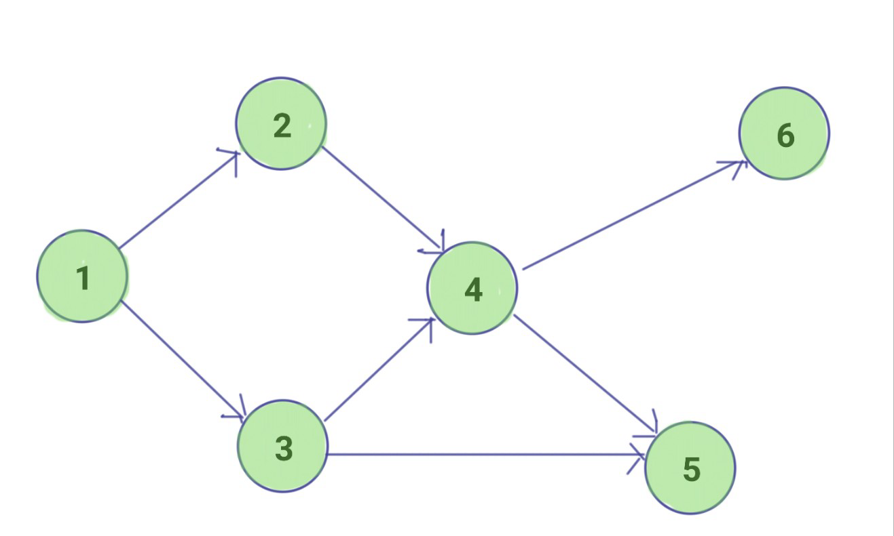

# TIL - 2025.03.25 (화요일)

## 📝 오늘 배운 것 (위상정렬 알고리즘 (Topology Sort))

### 위상 정렬 (Topology Sort)

- DAG 에서 정점을 나열하는 알고리즘

- DAG란?
    - Directed Acyclic Graph
    - 방향이 있고, 사이클이 없는 그래프



- 노드간 선 후 관계를 나타내기 위해 사용한다.
    - ex) 작업 공정, 스케줄링
    - B 작업은 A작업이 선행되어야 진행할 수 있다.

- 사이클이 존재하는 그래프는 위상 정렬을 할 수 없다.

### 구현 방법

1. 진입 차수가 0인 정점 선택
2. 선택된 정점을 위상 정렬된 대상으로 출력
3. 해당 정점과 연결된 간선을 제거 (진입 차수를 감소)
4. 모든 노드를 다 정렬할 때 까지 1 ~ 3 을 반복

### 시간 복잡도

모든 노드를 확인하며 해당 노드와 연결된 간선을 제거해야 하므로 시간 복잡도 O(V+E)가 된다.

## 💡 문제 해결

### 예시 문제

[백준 14567 선수과목(Prerequisite)](https://www.acmicpc.net/problem/14567)

```python
import sys
from collections import deque
input = sys.stdin.readline

n, m = map(int, input().split())
indegree = [0] * (n+1)
graph = [[] for _ in range(n+1)]

for _ in range(m):
    a, b = map(int, input().split())
    graph[a].append(b)
    indegree[b] += 1

answer = [1] * (n+1)

def topology_sort():
    result = []
    q = deque()
    for i in range(1,n+1):
        if indegree[i] == 0:
            q.append(i)
            answer[i] = 1

    for i in range(1, n+1):
        now = q.popleft()
        result.append(now)

        for next in graph[now]:
            indegree[next] -= 1
            if indegree[next] == 0:
                q.append(next)
            answer[next] = answer[now] + 1
    print(*answer[1:])
topology_sort()
```

위상 정렬을 2개의 배열을 만드는데 하나는 2중 배열이다. 이 배열에는 인덱스 값에 해당 노드와 연결된 다른 노드의 번호를 기록해 두고

다른 하나의 배열 indegree에는 해당 노드와 연결된 다른 노드에 진입 차수를 1늘리는 것이다.

```python
for _ in range(m):
    a, b = map(int, input().split())
    graph[a].append(b)
    indegree[b] += 1
```

다음으로 indegree 배열 즉 진입 차수와 관련된 배열을 돌면서 진입차수가 0인 즉 시작 점을 큐에 넣게 된다.

```python
q = deque()
    for i in range(1,n+1):
        if indegree[i] == 0:
            q.append(i)
            answer[i] = 1
```

시작점은 큐에 넣은 후 다시 반복하며 큐에 담긴 노드 정보를 빼내 며 해당 노드가 진출하는 노드들을 방문하고 방문한 노드의 indegree 값을 1 감소 시킨다. 이 후 방문한 노드가 진입 차수가 0이 되면 해당 노드를 다시 큐에 넣으며 순차적인 경로를 기록한다.

## 🔍 더 알아볼 것

### 위상정렬 관련 문제

<input type="checkbox"> ACM Craft - 백준 1005번 풀어보기

<input type="checkbox"> 줄 세우기 - 백준 2252번 풀어보기

## 🧐 느낀 점

## 📚 참고 자료

- [[백준(python)] 14567번 : 선수과목 (Prerequisite)](https://velog.io/@heyoni/14567)