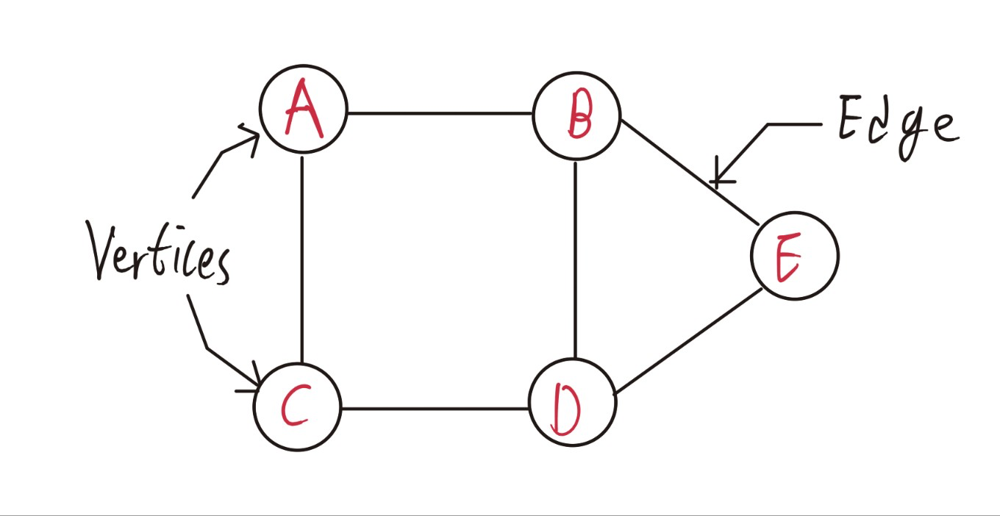
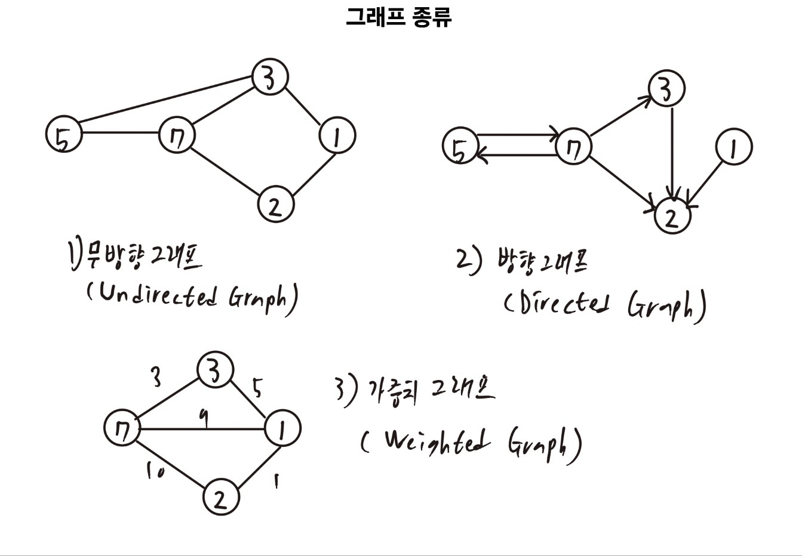
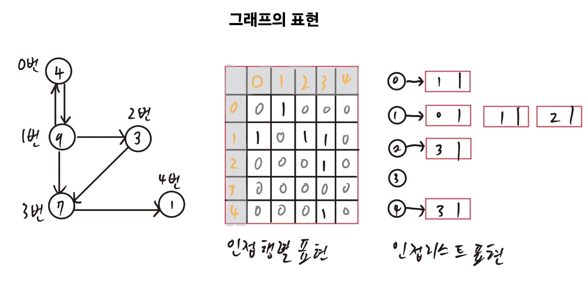

# TIL - 2025.03.27 (목요일)

## 📝 오늘 배운 것 (그래프 종류/표현방식)

### 그래프의 기본 개념  

그래프는 이산수학과 컴퓨터 과학에서 중요한 자료구조로, 정점(vertices)과 간선(edges)의 집합으로 구성된다.

### 기본용어

**정점**(vertex/Node)

- 그래프의 기본 단위로, 노드라고 불린다.
- 그래프 이론에서는 특징이 없는 불가분의 객체로 취급되지만. 응용에 따라 추가 구조를 가질 수 있다.
- 그래프 G에서 정점 집합은 V로 표기된다.

**간선**(Edge/Arc)

- 두 정점을 연결하는 선으로, 아크(arc)라고 불린다
- 그래프 G에서 간선 집합은 E로 표기한다.
- 무방향 그래프에서는 간선이 순서가 없는 정점 쌍 {u,v}로 표현된다.
- 방향 그래프에서는 간선이 순서가 있는 정점 쌍(u,v)로 표현된다.

### 관련용어

- 인접(Adjacent): 두 정점이 간선으로 연결되어 있을 때 서로 인접해 있다고 한다.
- 차수(Degree): 한 정점에 연결된 간선의 수이다.
- 고립 정점(Isolated vertex): 차수가 0인 정점으로, 어떤 간선과도 연결되지 않은 정점이다.
- 단말 정점(Leaf/Pendant vertex): 차수가 1인 정점이다.

### 그래프의 종류

#### 무방향 그래프(Undirected Graph)

- 간선에 방향이 없는 그래프이다.
- 두 정점 간의 연결은 양방향으로 이동할 수 있다.
- 간선 {u,v} 와 {v,u}는 동일한 간선을 나타낸다.
- 예 : 사람들이 서로 악수하는 관계 - A와 B가 악수할 수 있고, B도 A와 악수할 수 있다.

#### 방향 그래프(Directed Graph)

- 간선에 방향이 있는 그래프로, 다이그래프(digraph)라고 한다.
- 간선은 보통 화살표로 표시되며, 특정 방향으로만 이동할 수 있다.
- 간선 (u,v)는 u에서 v로 가는 방향을 의미하며, (v,u)와는 다르다.
- 예 : 일방통행 도로나 한 방향으로만 흐르는 강 시스템

#### 가중치 그래프(Weighted Graph)

- 간선에 가중치(값)가 할당된 그래프이다.
- 가중치는 거리, 비용, 시간 등을 나타낼 수 있다.
- 경로의 길이는 경로에 포함된 모든 간선의 가중치 합이다.
- 무방한 가중치 그래프와 방향 가중치 그래프 모두 존재한다.
- 예 : 뉴욕에서 마이애미까지의 도로 여행에서 거리나 연료 비용을 가중치로 표현할 수 있다.

### 그래프의 표현 방식

#### 인접 행렬(Adjacency Matrix)

- n개의 정점을 가진 그래프를 nxn 크기의 2차원 행렬로 표현한다.
- 행과 열은 그래플의 정점을 나타낸다.
- 행렬의 원소 A[i][j]는 정점 i와 j사이에 간선이 있으면 1, 없으면 0이다.
- 가중치 그래프의 경우, 간선의 가중치를 행렬 원소의 값으로 사용한다.
- 무방향 그래프의 인접 행렬은 대칭 행렬이다.(A[i][j] = A[j][i])
- 공간 복잡도: O(V²), 여기서 V는 정점의 수이다.
- 장점 : 두 정점 간의 간선 여부를 O(1) 시간에 확인할 수 있다.
- 단점 : 희소 그래프(간선이 적은 그래프)에서는 공간 낭비가 크다.

#### 인접 리스트(Adjacency List)

- 각 정점마다 해당 정점에 인접한 정점들의 리스트를 유지한다.
- 각 정점은 자신과 연결된 정점들의 연결 리스트나 배열을 가진다.
- 예 : 정점 A가 B와 C에 연결되어 있다면, A의 인접 리스트는 [B,C]이다.
- 공간 복잡도 : O(V+E), 여기서 V는 정점의 수, E는 간선의 수이다.
- 장점 : 희소 그래프에서 공간 효율적이며, 한 정점의 모든 인접 정점을 쉽게 순회할 수 있다.
- 단점 : 두 정점 간의 간선 존재 여부를 확인하는 데 O(V) 시간이 걸릴 수 있다.

