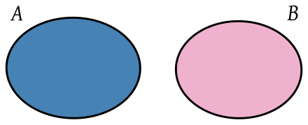
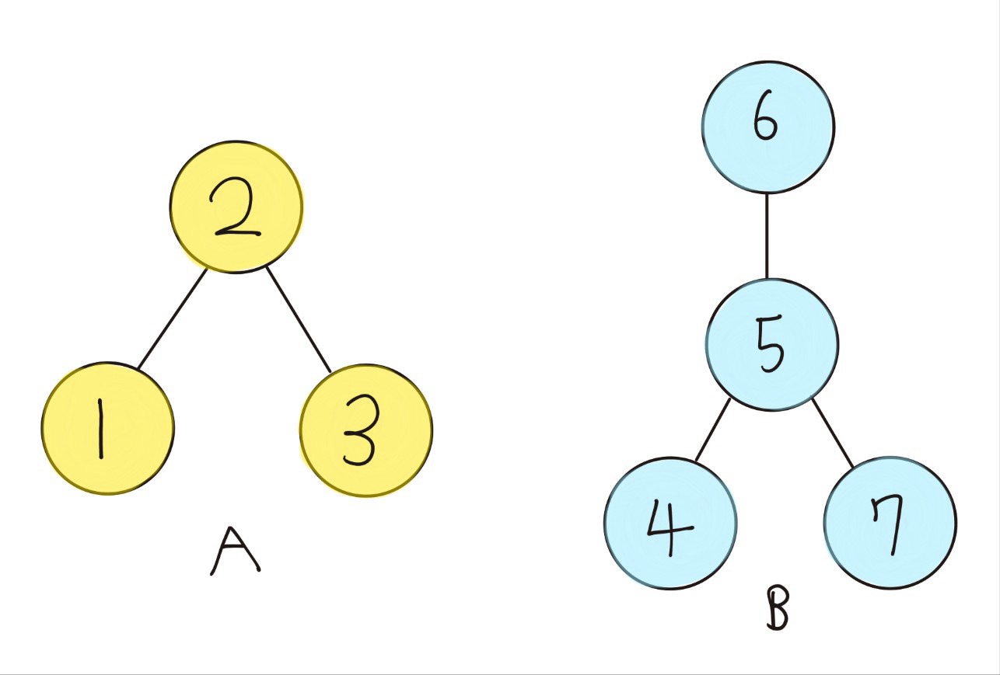
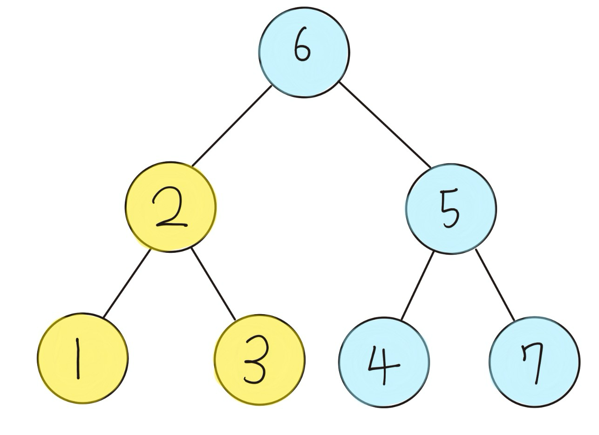

# TIL - 2025.03.28 (금요일)

## 📝 오늘 배운 것 (유니언 파인드(Union-Find))

### 유니언 파인드 개념

유니언-파인드 알고리즘은 주로 그래프 문제에 적용하는데 노드들을 특정 집합으로 나눈 때 사용한다. 같은 집합에 속한 노드들을 확인할 수 있다.

### 서로소 집합(disjoint sets)

서로소 집합은 공통 원소가 없는 두 집합을 뜻한다. 예를 들어서 {1, 2, 3}과 {4, 5, 6}은 서로소이며 {1, 2, 3}과 {3, 4, 5}는 아니다.



Union-Find는 서로소 집합 자료 구조를 만들 수 있다. 집합에서 노드를 합치고 부모를 찾아 서로소 집합을 찾아내는 알고리즘이다.



2개의 서로소 집합을 합치는 과정을 거친다.



## 구현 방법

### 1. 부모 노드 배열 초기화

노드 번호에 대응하도록 초기 부모 노드를 자신의 노드 번호 값으로 초기화 한다.

**1번 노드 -> 1**</br>
**2번 노드 -> 2**</br>
**3번 노드 -> 3**</br>
**...**

각 노드별로 부모 노드 번호를 보관하며 노드별로 결합 여부를 알 수 있다.

```python
parent = [i for i in range(n + 1)]
#parent = [0, 1, 2, ..., n]
```

### 2. find 알고리즘

find 알고리즘은 특정 노드의 부모노드를 찾을 때 까지 재귀적으로 호출이 되는 구조이다.

```python
def find(x):
    if parent[x] == x:
        return x
    parent[x] = find(parent[x])	#부모 노드 찾을 때까지 호출
    return parent[x]
```

find 함수는 각 노드의 루트 노드를 재귀로 찾아가며 for문을 통해 find 연산을 n번 만큼 해주고 나면 배열이 다음과 같이 변한다.

|||||||||
|---|---|--|--|--|--|--|--|
|index(노드번호)|	1|	2|	3|	4|	5|	6|	7|
|부모 노드|	6	|6	|6	|6	|6	|6	|6|

모든 노드가 6이 되며 하나의 서로소 집합이 된다.

### 3. union 알고리즘

union 알고리즘은 최상위 노드를 기준으로 다른 부모 노드의 값을 갱신한여 서로 다른 집합을 합친다.
아래 함수는 부모 노드의 번호가 작은 노드를 중심으로 결합한다.

ex) union(4,6)

- 4번 노드가 6번 노드보다 작으므로 4번 노드가 부모 노드가 된다.
- 6번 노드의 부모 노드를 4번 노드의 부모로 갱신한다.

부모 노드를 선정하는 기준은 문제 상황에 따라 달라질 수 있다.

```python
def union(x, y):
    x = find(x)
    y = find(y)
  	#부모 노드 번호가 작은 노드 중심으로 합병
    if x < y:	
        parent[y] = x
    else:
        parent[x] = y
```

#### Union 연산 전

|||||||||
|---|---|--|--|--|--|--|--|
|index(노드번호)|	1|	2|	3|	4|	5|	6|	7|
|부모 노드|	2	|2	|2	|5	|6	|6	|5|

#### Union 연산 이 후

|||||||||
|---|---|--|--|--|--|--|--|
|index(노드번호)|	1|	2|	3|	4|	5|	6|	7|
|부모 노드|	2	|6	|2	|5	|6	|6	|5|

union 연산 이 후 2번 노드의 부모가 6번으로 변경된다.

## 🧐 느낀 점

그래프 부분에 도달하며 다양한 개념들을 새로 익혀야 해서 어려운 것 같다.

## 📚 참고 자료

- [위키백과-서로소 집합](https://ko.wikipedia.org/wiki/%EC%84%9C%EB%A1%9C%EC%86%8C_%EC%A7%91%ED%95%A9)
- [[Python] 분리 집합, Union-Find에 대해서 알아보자!](https://www.jongung.com/292)
- [python 유니온-파인드 알고리즘](https://michelangeloo.tistory.com/12)