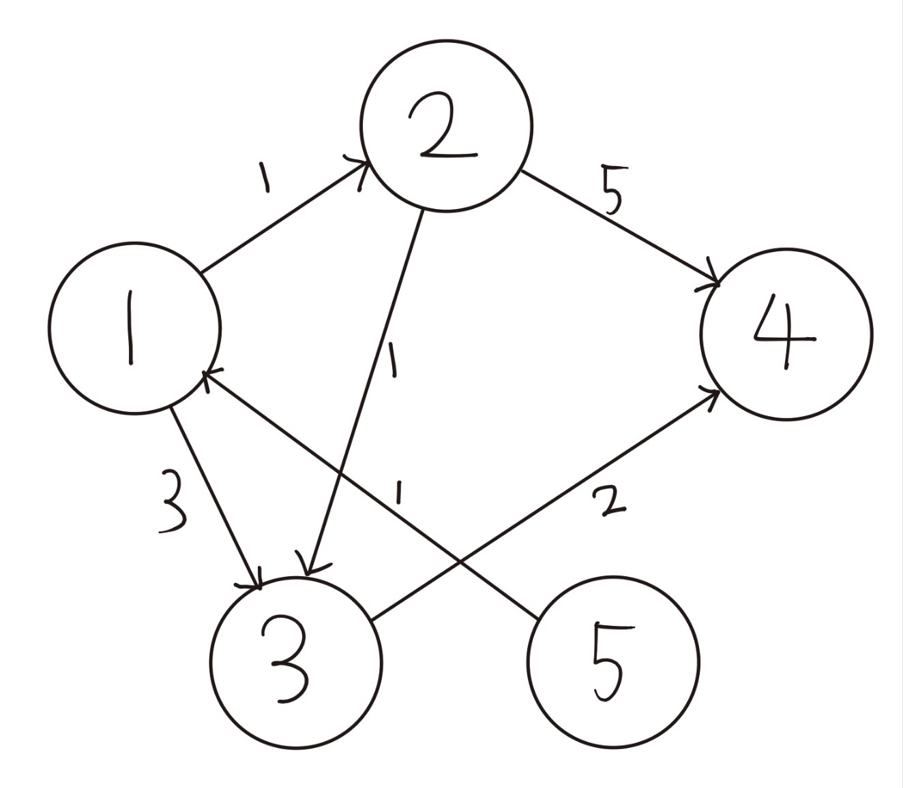
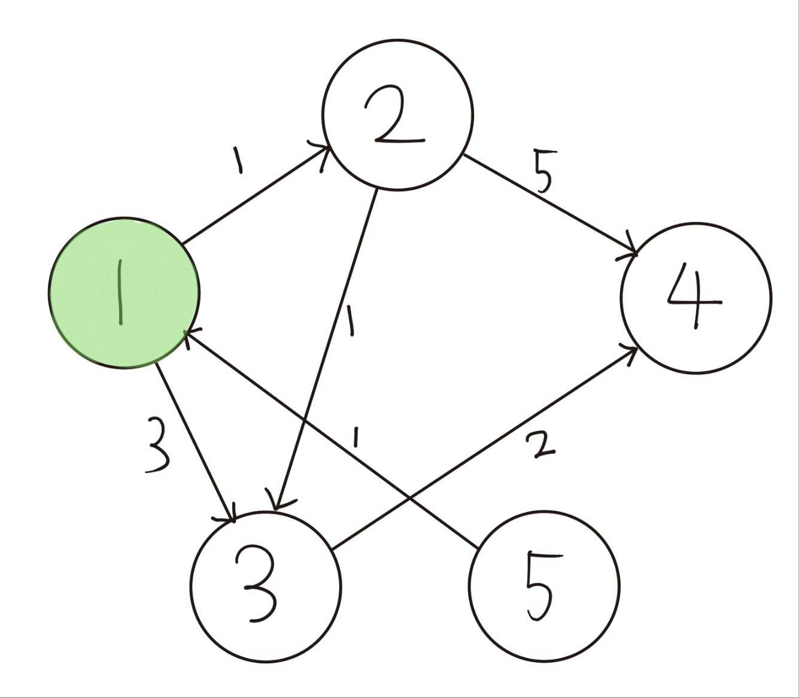
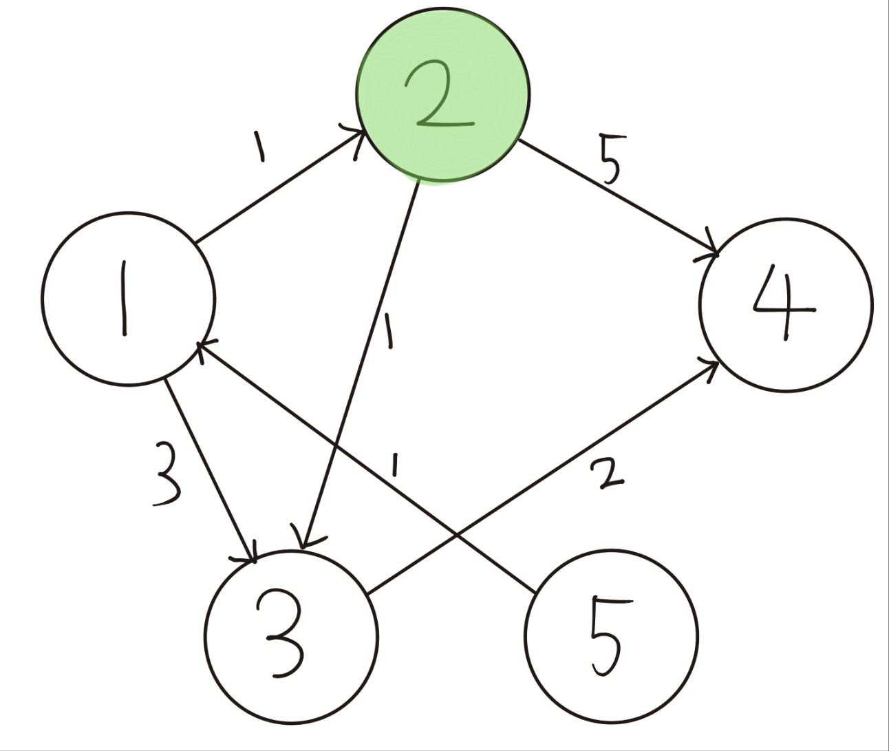
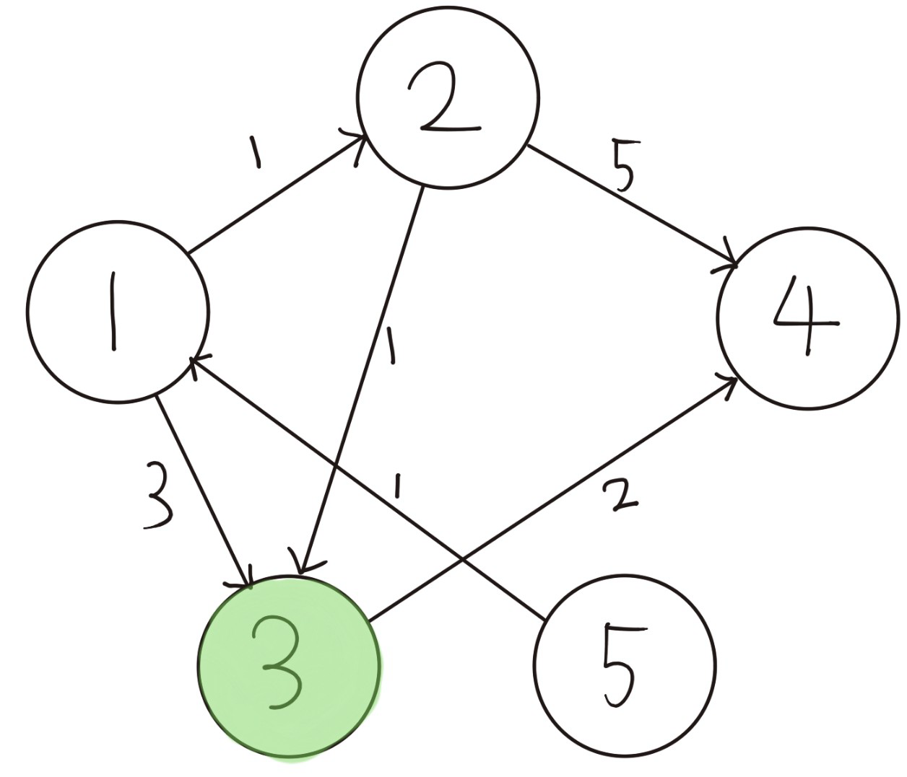
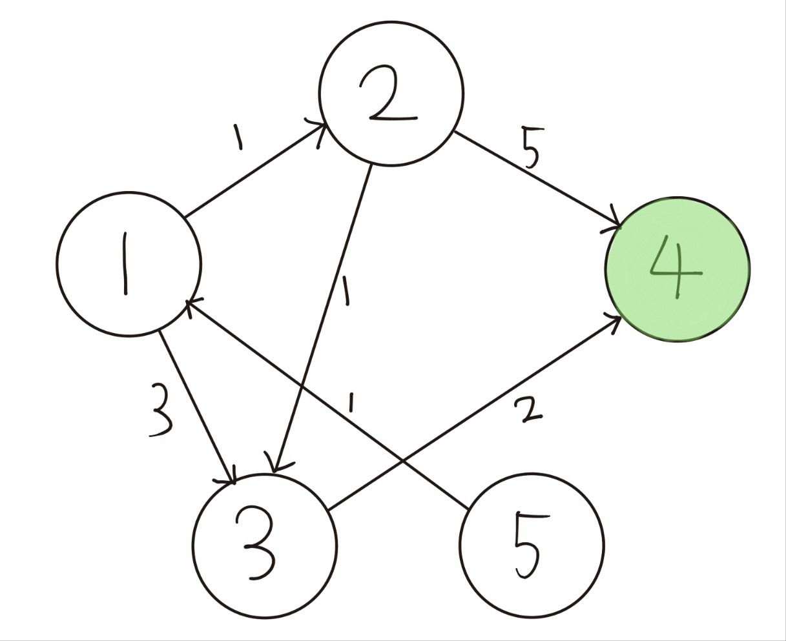

# TIL - 2025.03.29 (토요일)

## 📝 오늘 배운 것 (다익스트라 알고리즘 (Dijkstra Aglorithm))

다익스트라 알고리즘은 최단거리를 구하는 알고리즘이다.

### 다익스트라 알고리즘

- 최단거리를 구할 노드에서 시작하여, 거리가 입력된 노드 중 최단거리가 가장 작은 노드를 돌아가며 선택한다.
- 노드를 돌아가면서, 더 거리가 짧은 경우 값을 갱신한다.
- 다만 음의 간선을 포함할 수 없다.

### 이론 설명



1. 초기 모든 거리를 무한으로 설정한다.

```python
INF = 1e8
distance = [INF] * (n+1)
```

2. 처음에 자기자신의 거리를 0으로 놓고 1번 노드와 직접 연결된 노드 까지의 거리를 입력한다.
    - 이 후 1번 노드를 방문처리한다.



```python
def get_smallest_node():
    min_val = INF
    index = 0
    for i in range(1, n+1):
        if distance[i] < min_val and not visited[i]: 
        min_val = distance[i]
        index = i
    return index

def dijkstra(start):
    distance[start] = 0 # 시작 노드는 0으로 초기화
    visited[start] = True

    for i in graph[start]:
        distance[i[0]] = i[1] # 시작 노드와 연결된 노도들의 거리 입력
    for _ in range(n-1): 
        now = get_smallest_node() # 거리가 구해진 노드 중 가장 짧은 거리인 것을 선택
        visited[now] = True       # 방문 처리

        for j in graph[now]:
            if distance[now] + j[1] < distance[j[0]]: # 기존에 입력된 값보다 더 작은 거리가 나온다면,
            distance[j[0]]= distance[now] + j[1]    # 값을 갱신한다.
```

3. 방문처리 되자 않은 노드 중 입력된 거리가 가장 짧은 2번 노드를 선택한다.
    - 2번 노드에서 비교했을 때 3번 노드까지의 거리가 1 + 1 로 2가 되고 기존에 입력되어 있던 3 보다 작으니 갱신한다.
    - 4번 까지의 거리는 1 + 5로 6이 된다.
    - 2번 노드를 방문처리한다.



4. 방문처리 되지 않은 노드 중 거리가 가장 짧은 3번 노드를 선택한다.
    - 3번 노드를 기준으로 하였을 때, 4번 노드까지의 거리는 2 + 2로 4가 된다. 기존에 입력된 6보다 작으니 값을 갱신한다.
    - 3번 노드를 방문처리한다.



5. 방문처리 되지 않은 노드 중 거리가 가장 짧은 4번 노드를 선택한다.
    - 4번 노드의 경우 연결된 노드가 없으니 최단거리 구하기를 마친다.



## 💻 전체 코드

```python
n, m = map(int, input().split())
k = int(input())                 # 시작할 노드
INF = 1e8

graph = [[] for _ in range(n+1)] # 1번 노드부터 시작하므로 하나더 추가

visited = [False] * (n+1)
distance = [INF] * (n+1)

for _ in range(m):
    u, v, w = map(int, input().split()) # u: 출발노드, v: 도착노드, w: 연결된 간선의 가중치 
    graph[u].append((v, w))             # 거리 정보와 도착노드를 같이 입력합니다.

def get_smallest_node():
    min_val = INF
    index = 0
    for i in range(1, n+1):
        if distance[i] < min_val and not visited[i]: 
        min_val = distance[i]
        index = i
    return index

def dijkstra(start):
    distance[start] = 0 # 시작 노드는 0으로 초기화
    visited[start] = True

    for i in graph[start]:
        distance[i[0]] = i[1] # 시작 노드와 연결된 노도들의 거리 입력
    
    for _ in range(n-1): 
        now = get_smallest_node() # 거리가 구해진 노드 중 가장 짧은 거리인 것을 선택
        visited[now] = True       # 방문 처리

        for j in graph[now]:
        if distance[now] + j[1] < distance[j[0]]: # 기존에 입력된 값보다 더 작은 거리가 나온다면,
            distance[j[0]]= distance[now] + j[1]    # 값을 갱신한다.

dijkstra(k)
print(distance)

```

## 추가 개선 방법

현재 설명하는 다익스트라 알고리즘 코드의 경우 반복문을 돌면서 가중치가 작은 노드를 직접 선택하고 있는데 이 부분을 좀더 개선시키는 방안으로 우선순위 큐를 사용하는 방법이 있다.

```python
n, m = map(int, input().split())
k = int(input())                 # 시작할 노드
INF = 1e8

graph = [[] for _ in range(n+1)] # 1번 노드부터 시작하므로 하나더 추가

distance = [INF] * (n+1)

for _ in range(m):
    u, v, w = map(int, input().split()) # u: 출발노드, v: 도착노드, w: 연결된 간선의 가중치 
    graph[u].append((v, w))             # 거리 정보와 도착노드를 같이 입력합니다.


import heapq

def dijkstra(start):
    q = []
    heapq.heappush(q, (0, start)) # 우선순위, 값 형태로 들어간다.
    distance[start] = 0

    while q:
        dist, now = heapq.heappop(q) # 우선순위가 가장 낮은 값(가장 작은 거리)이 나온다.

        if distance[now] < dist: # 이미 입력되어있는 값이 현재노드까지의 거리보다 작다면 이미 방문한 노드이다.
        continue               # 따라서 다음으로 넘어간다.

        for i in graph[now]:     # 연결된 모든 노드 탐색
        if dist+i[1] < distance[i[0]]: # 기존에 입력되어있는 값보다 크다면
            distance[i[0]] = dist+i[1]   #
            heapq.heappush(q, (dist+i[1], i[0]))
dijkstra(k)
print(distance)

```

위 코드를 보면 처음 설명했던 코드에 비해 짧아진 부분이 보이는데 기존에 반복문을 돌며 가중치가 작은 노드를 찾던 부분의 코드를 파이썬 heap을 사용해서 갱신한 것이다. 파이썬의 힙은 최소 힙이 기본 값이기 때문에 가장 작은 거리의 데이터가 먼저 나오게 되는 것이다.

## 🧐 느낀 점

오늘 배운 내용에 대한 개인적인 생각이나 느낌을 기록합니다.

## 📚 참고 자료

- [제목](링크)