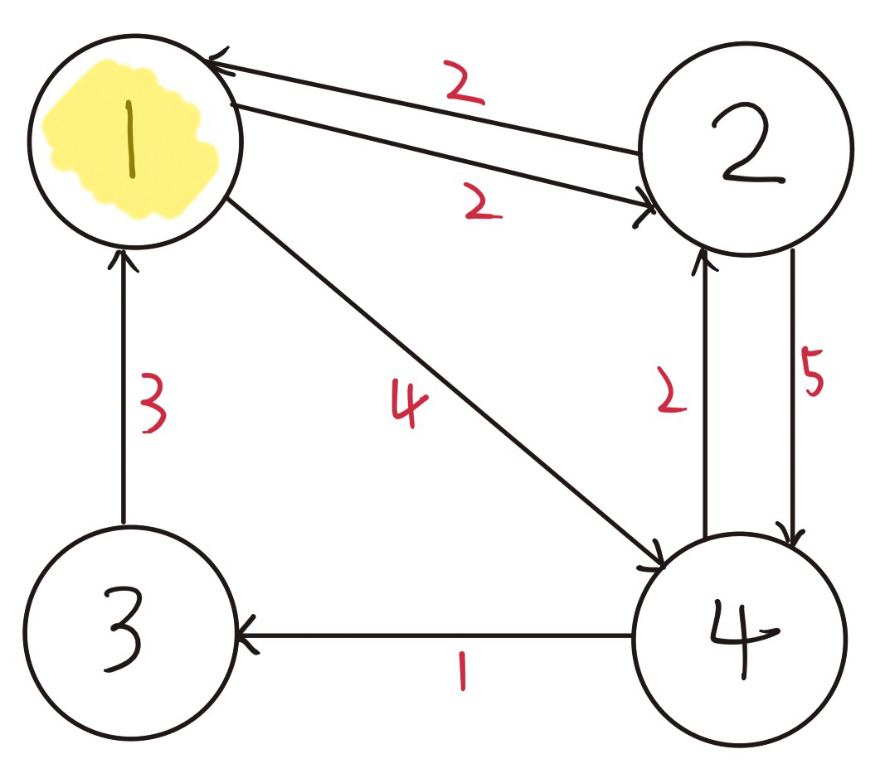

# TIL - 2025.03.30 (일요일)

## 📝 오늘 배운 것 (플로이드 워셜 알고리즘)

### 플로이드 워셜 알고리즘

플로이드 워셜(Floyd_Warshall) 알고리즘은 모든 지점에서 다른 모든 지점까지의 최단 경로를 모두 수해야 하는 경우 사용하는 알고리즘이다.

다익스트라 알고리즘에서 최단거리가 가장 짧은 노드를 탐색하는 과정을 생략할 수 있다.

모든 노드가 다른 노드로 가는 최단 거리 정보를 2차원 리스트에 저장한다. 노드의 개수 N만큼 점화식에 맞게 2차원 리스트를 갱신하는 다이나믹프로그램으로 볼 수 있다.

### ⏱️ 시간 복잡도

모든 최단 경로를 2차원 리스트에 담아 처리하기 때문에 매번 O(N^2)의 시간이 소요된다.
- 노드의 개수 N만큼 O(N^2)연산을 통해 해당 노드가 거치는 모든 경로를 고려한다.

현재 노드를 거쳐 지나가는 모든 경우를 찾기 위해, N-1 개의 노드 중 2개의 쌍을 선택하고 거리를 계산한다. 더 짧은 거리로 계산된다면 갱신한다. 

전체적인 시간 복잡도는 O(N^3)이다.

## 💡 문제 해결

> 오늘 해결한 문제나 어려웠던 부분을 기록합니다.

## 🔍 더 알아볼 것

- [ ] 항목 1
- [ ] 항목 2

## 🧐 느낀 점

오늘 배운 내용에 대한 개인적인 생각이나 느낌을 기록합니다.

## 📚 참고 자료

- [제목](링크)