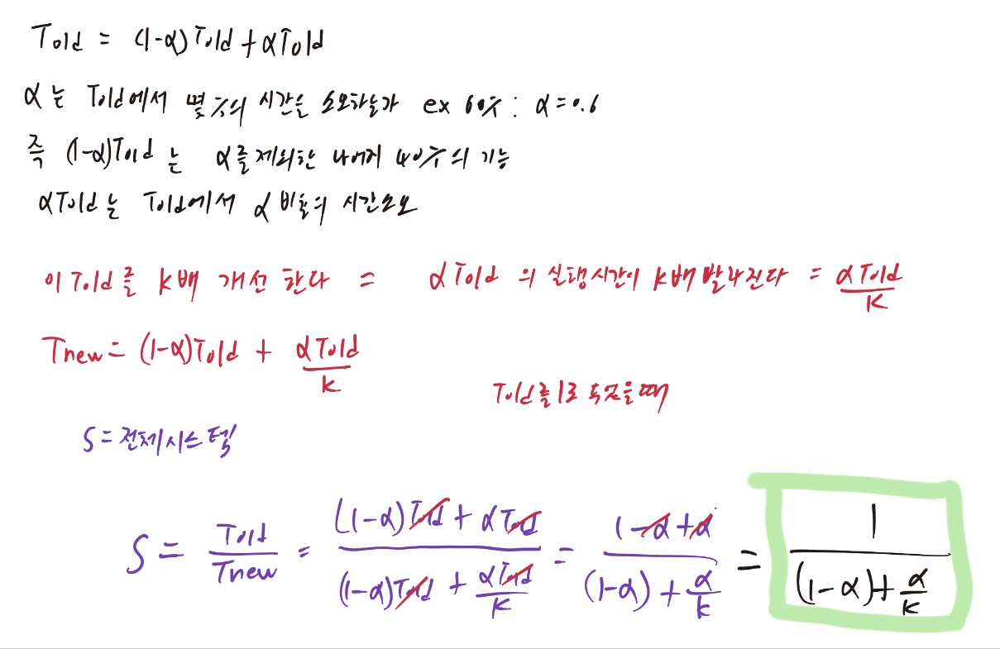
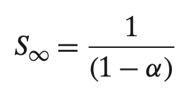

# TIL - 2025.03.31 (월요일)

## 📝 오늘 배운 것 (CSAPP 1.8 ~ 1.10)

### 1.8 시스템은 네트워크를 사용하여 다른 시스템과 통신한다.

- 최신 시스템들은 네트워크에 의해 다른 시스템과 종종 연결된다.
- 개별 시스템의 곤점에서 볼때 네트워크는 또 다른 입출력 장치로 볼 수 있다.
- 시스템은 다른 컴퓨터로부터 받은 데이터를 읽어서 메인 메모리에 복사할 수 있다.
- 이메일, 메신저, 웹 페이지, FTP, Telnet 같은 것들이 네트워크를 통해 정보를 복사하는 기능을 이용한 것이다.

### 1.9 중요한 주제들

시스템이라는 것은 하드웨어 그 이상의 것이다. 응용프로그램의 실행이라는 궁극의 목적을 달성하기 위해 협력해야 하는 하드웨어와 시스템 소프트웨어가 서로 연결된 것을 말한다.

#### 1.9.1 Amdahl 의 법칙

계산학 분야의 초창기 개척자인 Gene Amdahl은 한 시스템의 일부 성늘 개선의 효율성에 대해 간단하지만 직관적인 관찰을 했고 이 관찰은 Amdahl의 법칙이라고 알려졌다.

- 어떤 시스템의 한 부분의 성능을 개선할 때, 전체 시스템 성능에 대한 효과는 그 부분이 얼마나 중요한가와 이 부분이 얼마나 빨라졌는가에 관계된다.

- 초기에 전체 시간의 60%만 소모한 이 시스템의 일부분이 3배 속도가 빨라진다고 가정했을 때 Amdahl의 법칙에 의한 속도 향상은 1.67x 이다.

비록 시스템의 주요 부분에 대해 실질적인 개선을 했지만 총 속도 향상은 매우 적다라는 것이 이 법칙의 주요 통찰이다. 전체 시스템을 상당히 빠르게 하기 위해서는 전체 시스템의 매우 큰 부분의 성능을 개선해야 한다는 것이다.

- 만약 k를 무한대로 두었을 때를 가정하면 즉 시스템 일부를 택해서 그 성능을 무시할 수 있을 정도의 시간이 걸리는 지점까지 속도를 올릴 수 있다고 한다면 다음과 같은 결과를 얻을 수 있다.

그래서 예시로 시스템의 60%를 시간이 거의 걸리지 않는 수준까지 속도를 올릴 수 있다면 총 속도 개선율은 여전히 1/0.4 = 2.5x 밖에 되지않는다.

#### 1.9.2 동시성과 병렬성

컴퓨터가 더 많은 일을 해내고, 더 빨리 실행되기를 원하는 이 요구가 컴퓨터의 성능개선을 지속적으로 주도해왔다.

- 동시성(concurrency)라는 용어는 다수의 동시에 벌어지는 일을 갖는 시스템에 관한 일반적인 개념을 말할 때 사용
- 병렬성(parallelism)라는 용어는 동시성을 사용해서 시스템을 보다 빠르게 동작하도록 하는 것을 말할 때 사용

🖥️**쓰레드 수준 동시성**

프로세스 추상화 개념을 이용하면 다수의 프로그램이 동시에 실행되는 시스템을 생각해 볼 수 있으며, 이것은 결국 동시성르로 이어지게 된다. 쓰레드를 이용하면 한 개의 프로세스 내에서 실행되는 다수의 제어 흐픔을 가질 수도 있다.

1960년대 초반 시간 공유(time-sharing)기법의 등장으로 동시 실행에 대한 지원이 컴퓨터 시스템에 나타났다. 관습적으로 이 동시 실행은 시뮬레이션 형태로 실행되었다.

- 이것은 마치 곡예사가 여러 개의 공을 저글링하는 것과 같이 한개의 컴퓨터가 실행하는 프로세스를 빠르게 전환하는 방법을 사용한다.

- 하나의 윈도우에 웹 브라우저를 실행하면 서 다른 윈도우에는 문서 편집기를 사용하며 동시에 스트리밍 음악을 플레이 하는 것처럼 한 사용자가 다수의 태스크에 동시에 연관될 수 있게 해준다.

- **단일 프로세서 시스템**: 한개의 프로세서에 계산이 이루어지는 시스템
- **멀티 프로세서 시스템**: 시스템이 여러 개의 프로세서를 가지고 하나의 운영체제 커널의 제어 하에 동작하는 경우
- **하이퍼 쓰레딩**: 하이퍼스레딩은 인텔이 동시 멀티스레딩을 구현한 기술이다. 물리상 실행 장치 한 개에 가상 실행 장치 두 개를 할당해 성능을 높이려는 기술이다.

*멀티 코어 프로세서*는 여러개의 CPU(코어)를 하나의 집적화된 칩에 내장하고 있다. 이 프로세서 칩은 네개의 CPU 코어를 가지고 있으며, 각각 별도의 L1, L2 캐시를 가지고 코어는 메인 메모리 인터페이스뿐만 아니라 상위 수준 캐시를 공유한다. 

*멀티 쓰레딩*이라고 하는 하이퍼 쓰레딩은 하나의 CPU가 여러 개의 제어 흐름을 실행할 수 있게 해주는 기술이다. 이것은 프로그램 카운터나 레지스터 파일 같은 여러 개의 동일한 CPU하드웨어를 가지고 있는 반면, 부동소수 연산기와 같은 다른 부분들은 한개의 하드웨어만 가지고 있는 구조와 연관되어 있다.

멀티 프로세싱의 이용은 시스템의 성능을 두 가지 방법으로 개선할 수 있다.

1. 다수의 태스크를 실행할 때, 동시성을 시뮬레이션할 필요를 줄여준다.
2. 멀티 프로세싱으로 한개의 응용프로그램을 빠르게 실행할 수 있지만. 프로그램이 병렬로 효율적으로 실행할 수 있는 멀티쓰레드의 형태로 표현되었을 때에만 가능하다.

🕹️ **인스트럭션 수준 병렬성**

최근의 프로세서들은 훨씬 낮은 수준에서의 추상화로 여러 개의 인스트럭션을 한번에 실행할 수 있다. 이러한 특성을 인스트럭션 수준의 병렬성이라고 한다.

인스트럭션들은 시작부터 종료까지 훨씬 긴 시간이 필요하지만, 프로세서는 여러 가지 교묘한 기법을 이용해서 한번에 100개의 인스트럭션까지 처리할 수 있다.

- **파이프라이닝**: 하나의 인스트럭션을 실행하기 위해 요구되는 일들을 여러 단계로 나누고 프로세서 하드웨어가 일련의 단계로 구성되어 이들 단계를 하나씩 각각 수행한다. 이들 단계는 병렬로 동작할 수 있으며 서로 다른 인스트럭션의 다른 부분을 이용하여 작동한다. 매우 단순한 하드웨어 설계로도 사이클당 한개의 인스트럭션 실행에 근접하는 실행 속도를 유지할 수 있다.

- **슈퍼스케일러(super scaler)**: 사이클당 한개 이상의 인스터럭션을 실행할 수 있는 프로세서

🖨️ **싱글 인스트럭션, 다중 데이터 병렬성(SIMD)**

많은 최신 프로세서들은 최하위 수준에서 싱글 인스트럭션, 다중 데이터 즉SIMD 병렬성이라는 모드로 한개의 인스트럭션이 병렬로 다수의 연산을 수행할 수 있는 특수 하드웨어를 가지고 있다.

예시로 인텔과 AMD의 최신 세대의 프로세서들은 8쌍의 단일정밀도 부동소수들 간의 덧셈 연산을 병렬로 실행할 수 있는 인스트럭션을 가지고 있다.

이들 SIMD 인스트럭션들은 대개 영상, 소리, 동영상 데이터 처리를 위한 응용프로그램의 속도를 개선하기 위해 제공된다.

#### 1.9.3 컴퓨터 시스템에서 추상화의 중요성

추상화는 전산학에서 가장 중요한 개념이다. 예를 들면, 좋은 프로그래밍 연습의 한 가지 측면들은 함수들을 간단한 응용프로그램 인터페이스 API로 정형화하는 것으로 프로그래머가 그 내부의 동작을 고려하지 않으면서 코드를 사용할 수 있도록 해준다.

프로세서 측면에서, 인스트럭션 집합 구조는 실제 프로세서 하드웨어의 추상화를 제공한다. 이러한 추상화로 인해 기계어 코드 프로그램은 마치 한 번에 하나의 인스트럭션을 실행하는 프로세서에서 실행되는 것처럼 동작한다. 실제 하드웨어는 훨씬 더 정교해서 여러 개의 인스트럭션을 병렬로, 그러나 항상 간단한 순차적인 모델에 의거한 방식으로 실행한다.

파일을 입출력 장치의 추상화로, 가상메모리는 프로그램 메모리의 추상화로 프로세스는 실행 중인 프로그램의 추상화에 추가로 가상머신이 있다.

**가상머신**: 운영체제, 프로세서, 프로그램 모두를 포함하는 컴퓨터 전체의 추상화를 제공한다. 가상머신 개념은 1960년대 IBM에 의해 소개되었는데, 최근에 와서는 여러 종류의 운영체제(마이크로소프트 윈도우, Mac OS X, Linux 등)나 동일한 운영체제의 다른 버전에서 프로그램을 실행할 수 있도록 해야 하는 컴퓨터들을 관리하는 방법으로 더욱 두드러지게 나타나고 있다.
