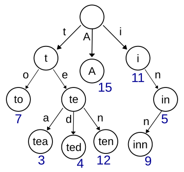

# TIL - 2025.04.02 (수요일)

## 📝 오늘 배운 것 (트라이 Trie)

### 트라이(Trie)?

트라이(Trie)는 문자열을 저장하고 효율적으로 탐색하기 위한 트리 형태의 자료구조이다. 주로 문자열이 키인 경우가 많으며, 문자열 특화 자료구조의 대표적인 예이다.



### 특징

- 이진 탐색 트리와 달리 노드 자체에 키를 저장하지 않고, 노드가 트리에서 차지하는 위치가 연관된 키를 정의한다.
- 노드의 모든 자손은 해당 노드에 연관된 문자열의 공통 접두사를 공유한다.
- 루트는 빈 문자열에 연관된다.
- 각 노드는 자식 노드들에 대한 포인터를 가지고 있으며, 일반적으로 <Key, Value> 형태의 Map 구조를 사용한다.

#### 시간 복잡도

- 트라이 생성 시간 복잡도 : O(M*L) - M은 총 문자열의 수, L은 가장 긴 문자열의 길이
- 삽입 시간 복잡도 : O(L) - 가징 긴 문자열 길이만큼만 연산 필요
- 삭제 시간 복잡도 : O(L) - 가장 긴 문자열 길이만큼만 탐색
- 삭제 시간 복잡도 : O(L) - 문자열 길이에 비례

이론적으로는 트라이의 시간 복잡도가 해시나 이진 검색 트리보다 좋지만, 실제 구현에서는 메모리 사용량 때문에 더 느리게 동작할 수 있다.

### 작동원리

- 트리의 루트에서 시작하여 자식들을 따라가면서 생선된 문자열들이 트라이에 저장된다.
- 한 문자열에서 다음에 나오는 문자가 현재 문자의 자식 노드가 된다.
- 문자열의 끝을 표시하는 변수를 추가하여 완전한 단어를 구분한다.
- 문자열 탐색시 DFS 형태로 검색한다.

### 장단점

#### **장점**

- 시간 복잡도 효율성: 문자열 탐색시 O(L) 의 시간 복잡도를 가진다. (L은 문자열의 길이)
- 단순 비교나 이진 탐색 트리보다 문자열 탐색에 훨씬 효율적이다.
- 문자열의 집합 개수와 상관없이 찾고자 하는 문자열의 길이만큼만 시간이 소요된다.

#### **단점**

- 저장 공간의 크기가 크다.
- 각 노드에서 자식들에 대한 포인터들을 배열로 모두 저장하고 있어 메모리 사용량이 많다.

### 트라이의 활용

- 검색어 자동완성 기능
- 사전에서 단어 찾기
- 문자열 검사
- 자연어 처리(NLP) 분야에서 문자열 탐색

## Trie 구현 예시 (python)

### 트라이 구현 코드

```python
class Node:
    def __init__(self, identifier=''):
        self.identifier = identifier
        self.children = {}
        self.isEnd = False

class Trie:
    def __init__(self):
        self.root = Node(identifier='root')
    
    def insert(self, x: str):
        """문자열 x를 트라이에 삽입합니다."""
        cur = self.root
        for i in range(len(x)):
            if x[i] not in cur.children:
                cur.children[x[i]] = Node(identifier=x[i])
            cur = cur.children[x[i]]
        cur.isEnd = True
    
    def search(self, x: str):
        """x가 트라이에 존재하면 True, 아니면 False를 반환합니다."""
        cur = self.root
        for i in range(len(x)):
            if x[i] not in cur.children:
                return False
            cur = cur.children[x[i]]
        return cur != self.root and cur.isEnd
    
    def delete(self, x: str):
        """트라이에서 문자열 x를 삭제합니다."""
        def _delete(cur, j=0):
            if j == len(x):
                cur.isEnd = False
                return bool(cur.children)
            
            c = x[j]
            if c not in cur.children:
                return True
            
            should_keep = _delete(cur.children[c], j+1)
            
            if not should_keep:
                del cur.children[c]
            
            return bool(cur.children) or cur.isEnd
        
        _delete(self.root)

```

### 접두사 검색 특화 트라이 구현

```python
class TrieNode:
    def __init__(self):
        self.children = {}
        self.end_of_word = False

class Trie:
    def __init__(self):
        self.root = TrieNode()
    
    def insert(self, word):
        current = self.root
        for char in word:
            if char not in current.children:
                current.children[char] = TrieNode()
            current = current.children[char]
        current.end_of_word = True
    
    def search(self, prefix):
        """접두사로 시작하는 모든 단어 찾기"""
        result = []
        current = self.root
        
        # 접두사의 마지막 노드 찾기
        for char in prefix:
            if char not in current.children:
                return result
            current = current.children[char]
        
        # 접두사부터 시작하는 모든 단어 찾기
        self._dfs(current, prefix, result)
        return result
    
    def _dfs(self, node, prefix, result):
        if node.end_of_word:
            result.append(prefix)
        
        for char, child in node.children.items():
            self._dfs(child, prefix + char, result)
```

## 📚 참고 자료

- [Trie - Wikipedia](https://en.wikipedia.org/wiki/Trie)