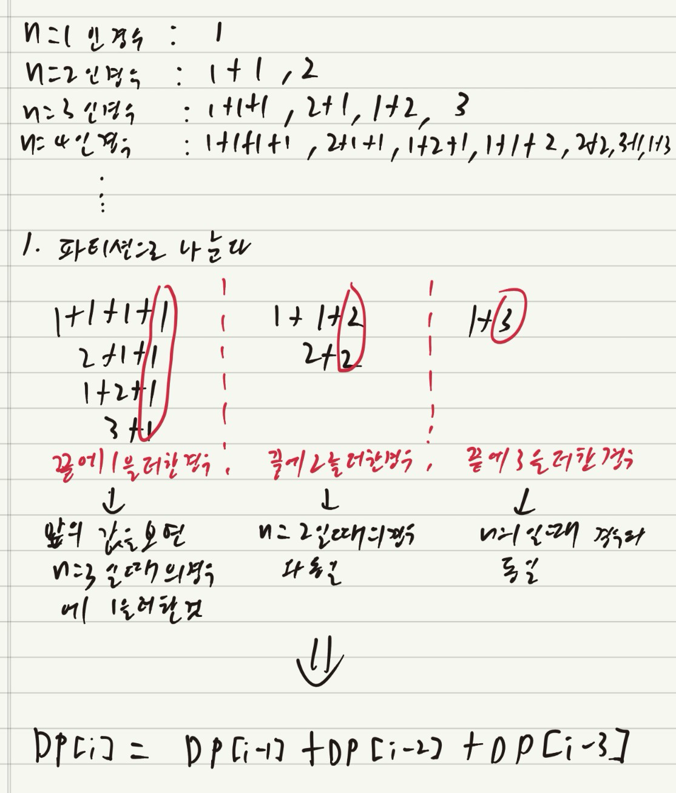

# TIL - 2025.04.03 (목요일)

## 📝 오늘 배운 것 (동적 계획법)

### 동적 프로그래밍 (Dynamic Programming)

동적 프로그래밍은 복잡한 문제를 더 작은 하위 문제로 나누어 해결하는 알고리즘 설계 기법이다. 큰 문제를 작은 문제로 분할하여 각 하위 문제의 해를 계산하고, 이를 이용하여 상위 문제의 해를 구하는 방식으로 동작한다.

### 기본 원리

- 문제 분할: 복잡한 문제를 더 작은 하위 문제로 나눈다.
- 메모이제이션(Memoization): 이미 계산한 결과를 저장하여 재사용함으로써 중복 계산을 피한다.
- 상향식 접근법: 가장 작은 하위 문제부터 해결하여 점차 상위 문제를 해결해 나간다.

|  동적 프로그래밍    |  분할 정복      |
|------|--------|
| 부분 문제가 중복되어 재활용 됨| 부분 문제가 서로 붕복되지 않음|
|메모이제이션 기법 사용|메모이제이션 기법 사용 안함|
|예 : 피보나치 수열| 예 : 병합 정렬, 퀵정렬|

### 실제 응용 분야

- 최단 경로 알고리즘(벨만-포드 알고리즘)
- 문자열 처리 알고리즘(최장 공통 수열 문제)
- DNA 서열 정렬
- 항공 스케줄링 및 라우팅
- 금융 분야의 포트폴리오 최적화
- 그래프 알고리즘
- 바이오인포매틱스

## 예시 문제

### 1. 백준 9095 1,2,3 더하기


이 문제를 풀기 위해 먼저 n이 1인 경우부터 손으로 일일이 계산을 진행한다.

- n = 1 -> 1개
- n = 2 -> 2개
- n = 3 -> 4개
- n = 4 -> 7개

이 후 n이 4인 경우에서 만들 수 있는 모든 경우를 자신이 생각하는 공통 부분으로 파티셔닝을 진행한다. 이 예시에서는 마지막에 더하고 있는 수가 1인지 2인지 3인지에 따라서 분리를 했다.

이 후 각각 공통된 부분과 분리된 부분을 살펴보면 마지막의 1을 더한 경우에서 1을 더하기 전에 있는 수들은 n이 3에서 구해진 수들에 1을 더한 것이라는 생각이 되며 마지막에 2를 더한 부분에는 n이 2였을 때 구했던 경우의 수에 2를 더한 것 이었다. 그리고 마지막에 3을 더한 경우는 n이 1이었을 때의 값에 3을 더한 것이라 느껴졌다.

그리고 각 파티션들을 모두 더한 값이 n=4 의 경우를 나타낸다는 것을 알게 되었다.

그럼 우리는 점화식

> DP[i] = DP[i-1] + DP[i-2] + DP[i-3]

이라는 식을 얻게 되었다. 만약 식을 검증하고 싶다면 n=5인 경우를 손으로 구하고 위와 같은 방법으로 검증을 하는 것도 좋다.



#### 풀이 코드

```python
n = int(input())
input_list = []
for _ in range(n):
    input_list.append(int(input()))

for input_data in input_list:
    dp = [0] * (input_data + 1)
    for i in range(1,input_data + 1):
        if i == 0:
            print(0)
        elif i == 1:
            dp[1] = 1
        elif i == 2:
            dp[2] = 2
        elif i == 3:
            dp[3] = 4
        else:
            dp[i] = dp[i-1] + dp[i-2] + dp[i-3]
    print(dp[input_data])
```

이 문제는 다이나믹 프로그램의 가장 기초적인 문제이다. 이 문제를 예시로 설명하는 이유는 이런 것이 다이나믹 프로그래밍이라는 맛보기? 느낌이다. 실제 문제들은 이 것보다 어렵다(내가 느끼기에는)

## 🔍 더 알아볼 것

- [ ] 냅색 알고리즘

## 🧐 느낀 점

다이나믹 프로그래밍 유형은 많은 연습과 풀이 경험이 쌓여야 할 것 같다... 그냥은 풀이 방법이 정립되지 않을 것 같다는 생각이 강하게 들고 있다.