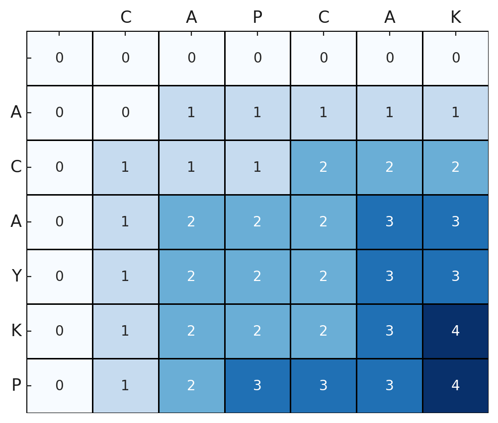

# TIL - 2025.04.04 (금요일)

## 📝 오늘 배운 것 (백준 9251 LCS)

### 문제

LCS(Longest Common Subsequence, 최장 공통 부분 수열)문제는 두 수열이 주어졌을 때, 모두의 부분 수열이 되는 수열 중 가장 긴 것을 찾는 문제이다.

예를 들어, ACAYKP와 CAPCAK의 LCS는 ACAK가 된다.데 필요한 곱셈 연산 횟수의 최솟값을 구하는 프로그램을 작성하시오. 입력으로 주어진 행렬의 순서를 바꾸면 안 된다.

### 입력

첫째 줄과 둘째 줄에 두 문자열이 주어진다. 문자열은 알파벳 대문자로만 이루어져 있으며, 최대 1000글자로 이루어져 있다.

### 출력

첫째 줄에 입력으로 주어진 두 문자열의 LCS의 길이를 출력한다.

### 예제 입력

ACAYKP
CAPCAK

### 예제 출력

4

## 💡 문제 해결

LCS 문제를 풀기 위해 2차원 DP 배열을 사용할 것이다. `DP[i][j]` 를 **문자열 A의 앞 i 글자와 문자열 B의 앞 j 글자 까지 고려 했을 때의 최장 공통 부분 수열의 길이**로 정의한다. 즉 DP 배열의 행을 문자열 A (길이 n)의 접두사 길이로, 열의 문자열 B (길이 m) 의 접두사 길이로 대응 시킨다. 이 때 인덱스 `i`나 `j`가 0인 경우는 **빈 문자열**을 의미하므로, 초기 조건으로 `DP[0][j] = 0` (빈 문자열과 B의 j글자 까지의 LCS 길이는 0) 및 `DP[i][0] = 0` (A의 i글자 까지와 빈 문자열의 LCS 길이는 0)을 설정한다. DP 배열의 크기는 편의를 위해 (n+1) * (m+1) 로 생성하여, 0번째 행과 열을 0으로 초기화 해 두면 점화식을 일관성 있게 적용할 수 있다.

- `dp[i][j]`의 의미: 문자열 A의 첫 `i`글자와 문자열 B의 첫 `j`글자 사이에서 찾을 수 있는 최장 공통 부분 수열의 길이
- 초기값: `dp[0][j] = 0` 및 `dp[i][0] = 0` (한 쪽이 빈 문자열이면 공통 부분 수열 길이는 0).

### 점화식 유도

- **문자가 일치하는 경우**: 만약 `A[i] == B[j]`라면, 이 문자는 공통 부분 수열의 연장에 기여한다. 따라서 이 경우 현재까지의 LCS 길이는 **이전 단계의 LCS 길이 + 1**이 된다. 구체적으로 `dp[i][j] = dp[i-1][j-1] + 1`로 계산한다. 이는 **두 문자열의 (i-1)번째와 (j-1)번째 까지의 LCS에 현재 문자를 추가**하는 것을 의미한다. 즉 새로운 공통문자 하나가 추가되었으므로 길이를 +1 증가시키는 것이다.

- **문자가 일치하지 않는 경우**: 만약 `A[i] != B[j]`라면, 현재 문자는 공통 부분 수열에 포함될 수 없다. 이 때는 **두가지 선택지**가 있다. 문자열 A의 현재 문자(`i`번째)를 버리거나, 문자열 B의 현재문자(`j`번째)를 버리는 것이다. 전자의 경우는 `dp[i-1][j]` (A에서 한 글자 줄였을 때의 LCS 길이), 후자의 경우는 `dp[i][j-1]` (B에서 한글자 줄였을 때의 LCS길이)로 돌아간다. 둘 중 더 큰 값을 현재 `dp[i][j]`로 채택하면 된다. 이는 **이전 단계까지 계산된 최적의 LCS 길이를 이어받는다**는 의미이다. 점화식으로 쓰면 `dp[i][j] = max(dp[i-1][j], dp[i][j-1])`로 정리할 수 있다.

요약하면 **문자가 같을 때는 대각선 위쪽 값에 1을 더하고, 다를 때는 좌측이나 위쪽 중 큰 값을 가져온다**는 의미이다. 마지막 `dp[n][m]` 까지 모두 채운 값이 곧 두 문자열의 LCS 길이가 된다.

### 예시 입력 케이스

예시로 문자열 **A = "ACAYKP"** 와 **B = "CAPCAK"** 가 주어졌다. 이 경우 두 문자열의 최장 공통 부분 수열은 **"ACAK"** 이며 그 길이는 4가 된다.​

이제 DP 표를 채우는 과정을 간단히 살펴보자. 먼저 DP 테이블의 0번째 행과 0번째 열은 앞서 언급한 대로 모두 0으로 초기화한다. 그런 다음, **행을 문자열 A의 문자(순서대로 A, C, A, Y, K, P), 열을 문자열 B의 문자(순서대로 C, A, P, C, A, K)** 에 대응시켜 2차원 표를 그린다.

이 표의 (i,j) 위치에 dp[i][j] 값을 채워나갈 것이다.

- 1행 (A의 첫 글자 'A') 채우기: B와의 문자를 순차 비교한다
- 열1 (B의 'C'): 'A' vs 'C' 일치하지 않으므로 위쪽(dp[0][1])과 왼쪽(dp[1][0]) 값 중 최대값인 0을 넣는다 → dp[1][1] = 0
- 열2 (B의 'A'): 'A' vs 'A' 일치하므로 대각선 위(dp[0][1]) 값에 1을 더해 0+1을 넣는다 → dp[1][2] = 1
- 열3 (B의 'P'): 'A' vs 'P' 불일치 → max(dp[0][3], dp[1][2]) = max(0, 1) = 1 → dp[1][3] = 1

이런 식으로 계속 진행하면 1행의 나머지 칸들도 채워지며, 결국 1행은 [0, 0, 1, 1, 1, 1, 1]이 된다. (맨 처음 0은 dp[1][0]이며 항상 0이다.)

2행 (A의 둘째 글자 'C')부터도 같은 방식으로 채운다. 각 칸에서 문자가 같으면 대각선+1, 다르면 위/왼쪽 중 큰 값으로 채워진다. 예를 들어 2행 1열은 'C' vs 'C'로 일치하여 dp[2][1] = dp[1][0] + 1 = 1이 되고, 2행 4열에서는 다시 'C' vs 'C'가 만나 dp[2][4] = dp[1][3] + 1 = 2가 되는 식입니다. 이런 절차를 문자열 길이만큼 반복하여 표 전체를 채운다.

### 예시 이미지



### 파이썬 코드

```python
A = input().rstrip()
B = input().rstrip()

# DP 테이블 초기화 (크기: (len(A)+1) x (len(B)+1))
dp = [[0] * (len(B) + 1) for _ in range(len(A) + 1)]

# 점화식을 이용해 DP 테이블 채우기
for i in range(1, len(A) + 1):
    for j in range(1, len(B) + 1):
        if A[i-1] == B[j-1]:              # 문자가 일치하는 경우
            dp[i][j] = dp[i-1][j-1] + 1   # 대각선 위 값 + 1
        else:                             # 문자가 일치하지 않는 경우
            dp[i][j] = max(dp[i-1][j], dp[i][j-1])  # 위쪽 vs 왼쪽 중 큰 값

# 두 문자열 전체 길이 부분의 DP 값 출력 (LCS의 길이)
print(dp[len(A)][len(B)])  # 출력: 4
```

## 🧐 느낀 점

DP 너무 어렵다.... 다른 글들을 보면 1차원 DP로 정리할 수 있다는 것 같은데 그건 도저히 이해가 되지 않아 결과가 느리더라도 2차원 배열로 이해하고 정리해 봤다.
