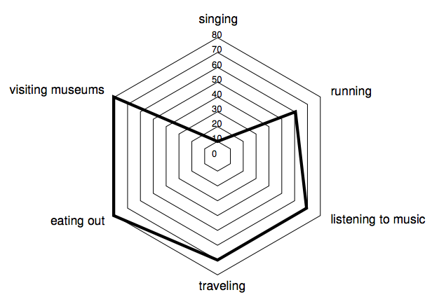
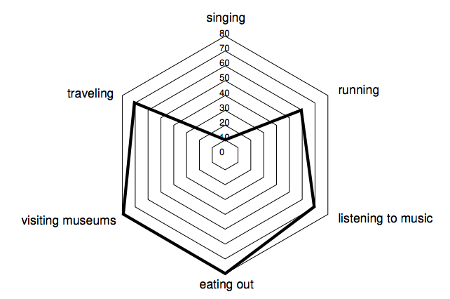

# TIL - 2025.04.09 (수요일)

## 📝 오늘 푼 문제 (백준 13869 Dating On-Line)

### 문제

> 외국어 문제로 번역해서 풀겠습니다.

알렉스는 완벽한 파트너를 찾기 위해 온라인 데이트 시스템에 가입했습니다. 이 시스템은 각 회원이 N가지 활동에 대한 만족도를 0점에서 100점까지 점수로 매기는 양식을 작성하도록 요구합니다. 이 정보를 잠재적인 데이트 상대에게 제공하기 위해 시스템은 "방사형 다이어그램"이라는 특수한 다각형으로 구성된 프로필을 생성합니다.

N개의 활동에 대한 방사형 다이어그램은 평면에 N개의 점을 표시하여 그립니다. 수직 방향에서 시작하여 시계 방향으로 i번째 점은 구성원이 지정한 i번째 활동을 나타내며, 다이어그램 중심에서 S i 만큼 떨어진 거리입니다. 여기서 S i 는 구성원이 해당 활동에 대해 부여한 점수입니다. 다이어그램 중심에서 각 연속된 점 쌍이 이루는 각도는 항상 같으며, 다각형은 끝점이 연속된 점인 선분을 그려서 형성됩니다. 방사형 다이어그램의 목적상 첫 번째 점과 마지막 점은 연속된 것으로 간주됩니다.

예를 들어, N = 6인 경우 Alex는 다음과 같은 활동을 지정할 수 있습니다. 노래 부르기(점수 S 1 = 10), 달리기(점수 S 2 = 60), 음악 감상(점수 S 3 = 70), 여행(점수 S 4 = 70), 외식(점수 S 5 = 80), 박물관 방문(점수 S6 = 80). 그러면 해당 방사형 다이어그램은 아래 그림과 같습니다.



방사형 다이어그램의 면적은 각 활동이 지정된 순서에 따라 달라지는데, 알렉스는 면적이 더 넓은 방사형 다이어그램을 묘사하는 프로필이 더 성공적일 것이라고 생각합니다. 예를 들어, 다음 그림의 방사형 다이어그램은 위 예시와 동일한 활동과 점수를 나타내지만 면적이 더 넓습니다.



알렉스는 0~100점 사이의 점수로 평가된 활동 목록이 주어졌을 때, 방사형 다이어그램의 가능한 최대 면적을 구하는 프로그램을 작성해 달라고 요청했습니다.

### 입력

첫째 줄에는 활동의 개수를 나타내는 정수 N이 주어진다(3 ​​≤ N ≤ 10 5 ). 둘째 줄에는 알렉스가 각 활동에 부여한 점수를 나타내는 N개의 정수 S 1 , S 2 , ... , S N 이 주어진다( i = 1, 2, ... , N일 때 0 ≤ S i ≤ 100).

### 출력

입력된 점수를 포함하는 방사형 다이어그램의 최대 면적을 나타내는 유리수를 한 줄에 출력하세요. 결과는 소수점 이하 세 자리까지 정확하게 출력해야 하며, 필요한 경우 반올림해야 합니다.

## 💡 문제 접근 방향

먼저 이 문제의 경우 방사형 차트에 표시된 도형의 넓이를 구해야 한다는 것이 문제 였으며 또한 이 다각형의 넓이를 가장 크게 만들어야 한다는 것을 느꼈다.

크래프톤 정글 4주차에 접어들며 그리디애 대해 학습을 하며 여러 문제를 풀던 중 경험했던 [통나무 건너뛰기](https://www.acmicpc.net/problem/11497) 문제와 풀이가 비슷하다는 것을 느꼈다.

우리는 최대한 넓은 삼각형을 만들어야 한다는 요구에 의해 낮은 값에서 시작해 가장 높았다 다시 낮아지는 값을 구하고 구해진 값을 이용해 삼각형의 넓이를 구해서 더한 값이 정답이 될 수 있겠다고 판단하고 접근을 했다.

### 나의 풀이

```python
from collections import deque
import math, sys

input = sys.stdin.readline
n = int(input())
status_list = sorted(list(map(int, input().split())), reverse=True)

result = []

for i in range(2):
    left = i
    q = deque()
    for status in status_list:
        if left == 0:
            q.append(status)
            left = 1
        else:
            q.appendleft(status)
            left = 0
    result.append(q)

max_result = 0
theta = 2 * math.pi / n
for lines in result:
    cal_status = 0
    for i in range(1, len(lines)):
        cal_status += 0.5 * lines[i-1] * lines[i] * math.sin(theta)
    cal_status += 0.5 * lines[0] * lines[-1] * math.sin(theta)
    max_result = max(max_result, cal_status)

print(f"{max_result:.3f}")
```

먼저 입력 값을 큰 값이 앞에 오도록 정렬했다. 이 후 deque를 이용했는데 파이썬 deque에서는 앞과 뒤에서 값을 넣어도 된다는 것을 이용했다. 파이썬의 다른 자료형도 가능할 것이기는 하다(더 좋은 풀이가 있다면 알려주세요)

left 라는 변수를 이용해 정렬된 데이터를 왼쪽과 오른쪽에서 저장하며 큐에 값을 저장했다. 이 후 이 과정을 한 번 더 반복했는데 왼쪽-오른쪽 넣은 값과 오른쪽-왼쪽 넣은 값이 다를 수 있다는 생각으로 진행했다.

지금 보면 굳이 필요했을까? 라는 생각이 들었고 GPT에게 물어볼 예정이다.

계속 설명하면 이 후에 계산된 결과를 이용해 삼각형의 두 변과 그 끼인 각? 을 이용해 삼각형의 넓이를 구하는 방법을 반복했다.

$A_i = \frac{1}{2} \cdot r_i \cdot r_{i+1} \cdot \sin\left(\frac{2\pi}{N}\right)$

위 공식을 이용해 삼각형들의 넓이를 구해 더한 값을 갱신하여 가장 넓은 값을 구하고 그 값을 출력했다.

마지막으로 GPT가 내 코드를 기반으로 정리해준 코드를 같이 첨부한다. 

```python
import math
import sys
from collections import deque

input = sys.stdin.readline

def make_zigzag(arr, start_left: bool):
    dq = deque()
    left = start_left
    for val in arr:
        if left:
            dq.appendleft(val)
        else:
            dq.append(val)
        left = not left
    return list(dq)

def calculate_area(points, theta):
    area = 0
    for i in range(len(points)):
        a = points[i]
        b = points[(i + 1) % len(points)]
        area += 0.5 * a * b * math.sin(theta)
    return area

n = int(input())
scores = list(map(int, input().split()))
scores.sort(reverse=True)

theta = 2 * math.pi / n
max_area = 0

# 두 가지 지그재그 배치 모두 시도
for start_left in (False, True):
    zigzag = make_zigzag(scores, start_left)
    area = calculate_area(zigzag, theta)
    max_area = max(max_area, area)

print(f"{max_area:.3f}")

```


## 🧐 느낀 점

그리디 풀이는 유추할 수 있었지만 다각형의 넓이를 구하는 과정에서 삼각형의 넓이를 구하는 공식이 생각이 나지 않아서 고생했다.
